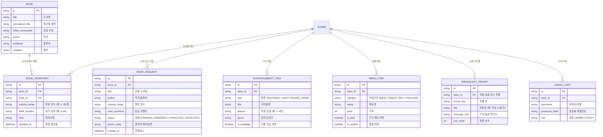

# 도메인 모델 (Domain Model) : 카툰플러스 (CartoonPlus)

카툰플러스는 만화카페 고객을 위한 도서/엔터테인먼트 검색 및 매장 안내 서비스와, 매장 직원을 위한 도서 재고 관리 및 매장 안내 방송 자동화 솔루션입니다.

---

## 1. 핵심 용어 사전 (Glossary)

| 용어 (한글) | 용어 (영문) | 설명 |
| :--- | :--- | :--- |
| **지점 / 매장** | `Store` | 카툰플러스의 개별 오프라인 매장 (예: 서울대입구역점, 잠실점 등). |
| **도서 마스터** | `Book` | 단행본/시리즈의 공통 도서 메타데이터 (제목, 정규화 제목, 초성, 작가, 출판사, 장르). |
| **도서 재고 / 권수** | `BookInventory` | 특정 지점에 비치된 실제 권수 범위(예: 1~15권), 서가 위치, 최신 갱신일. 카툰플러스 도서는 대여하지 않는다. |
| **도서 입고 신청** | `BookRequest` | 손님이 매장에 없는 도서의 입고를 신청하고 직원이 `접수`, `주문 완료`, `입고 완료`, `입고 불가` 단계로 내부 처리하는 내역. 입고 완료 도서는 신규 입고 도서로 고객에게 공개한다. |
| **서가 위치** | `ShelfLocation` | 매장 내 도서가 비치된 위치 코드 및 텍스트 설명 (예: `A-03 (순정만화 구역)`). |
| **즐길거리 (게임/보드게임)** | `EntertainmentItem` | 매장 내 구비된 닌텐도 스위치 / Xbox 게임 팩 및 보드게임 (타이틀명, 플레이 인원, 장르 등). |
| **점검 중 게임 목록** | `Pending Game Catalog` | 실제 매장 보유 여부가 아직 확인되지 않은 게임 목록의 공개 상태. 확인된 게임만 고객에게 노출한다. |
| **식음료 메뉴** | `MenuItem` | 매장에서 판매하는 음식 및 음료 (카테고리: 라면, 스낵, 커피/음료, 요금제 등, 가격, 베스트 여부). |
| **방송 프리셋** | `BroadcastPreset` | 매장 스피커로 송출할 사전 정의된 안내 음성 멘트 (제목, 재생 텍스트/TTS). |
| **예약 방송** | `Scheduled Broadcast` | 매장 PC 브라우저가 상시 실행된 상태에서, 별도 영업 시작 점검 없이 지정한 시각에 방송 프리셋을 자동으로 재생하는 운영 기능. 매일 반복, 요일 반복, 일회성 예약과 예약별 켜기·끄기를 지원한다. |
| **방송 실행 기록** | `Broadcast Run` | 수동 또는 예약 방송의 실행 시각과 성공·실패·대기 상태를 남긴 기록. 실패한 방송은 직원이 즉시 다시 재생할 수 있다. |
| **매장 이벤트** | `Store Event` | 고객에게 공개하는 지점별 진행 행사. 제목, 기간, 안내 내용, 이미지, 공개 여부를 가지며 종료일 다음 날 고객 화면에서 자동으로 숨긴다. 종료된 이벤트는 직원이 조회·복사할 수 있다. |
| **홈 화면** | `Home` | 카툰플러스와 매장의 브랜드·이용 경험을 소개하는 고객 첫 화면. 도서 검색은 별도 화면에서 제공한다. |
| **공백 무시 정규화** | `WhitespaceNormalization` | 도서명과 작가명 검색 시 공백/특수문자를 제거하여 '체인소 맨'과 '체인소맨'을 동일하게 매칭하는 검색 처리 방식. |
| **초성 검색** | `Initial-Consonant Search` | 초성으로만 이뤄진 검색어를 도서명·작가명의 한글 초성에 부분 일치시키는 검색 방식. |
| **직원** | `Staff` | 가입 승인을 받은 매장 운영자. 도서 재고, 도서 입고 신청, 게임·이벤트 정보, 방송과 예약 방송을 관리한다. |
| **관리자** | `Admin` | 직원이 가진 모든 운영 권한에 더해, 직원 계정의 가입 승인과 비활성화를 관리하는 사용자. |
| **직원 계정** | `Staff Account` | 이름, 로그인 아이디, 비밀번호, 전화번호 끝 네 자리로 신청하는 관리 화면 접근 수단. 가입 대기, 승인, 비활성화 상태를 가진다. 실제 이메일은 받지 않으며, 비밀번호를 잊은 직원에게는 관리자가 임시 비밀번호를 발급한다. |
| **최초 관리자** | `Initial Admin` | 서비스 도입 시 Supabase 관리 화면에서 수동으로 생성하는 첫 관리자 계정. 이후 직원 계정 승인은 관리 화면에서 처리한다. |
| **재고 가져오기** | `Inventory Import` | Caspio CSV에서 재고를 가져오는 작업. 도서명과 작가명이 같은 항목은 권수·서가 위치를 갱신하고, 새 항목은 추가한다. 기존 항목의 자동 삭제는 하지 않는다. |
| **운영 항목 보관** | `Operational Archive` | 도서 재고, 게임, 이벤트, 방송 예약을 고객 화면에서 즉시 숨기되 직원이 삭제 기록을 조회·복구할 수 있게 하는 정책. |
| **신규 입고 도서** | `New Arrival` | 직원이 재고로 처음 등록한 도서. 등록일부터 30일 동안 고객 화면의 최근 입고 목록으로 공개한다. 재고 수정은 신규 입고로 간주하지 않는다. |
| **출시 검증 지점** | `Launch Store` | 새 서비스를 실제 운영 흐름으로 먼저 검증하고 전환하는 지점. 현재는 서울대입구역점이다. |
| **운영 전환** | `Operational Cutover` | 기존 사이트의 운영을 새 서비스로 넘기는 시점. 새 서비스는 다음 주 일요일에 서울대입구역점 운영을 인수한다. |

---

## 2. 핵심 엔티티 관계 (Entity Relationship)

