# 도메인 모델 (Domain Model) : 카툰플러스 (CartoonPlus)

카툰플러스는 만화카페 고객을 위한 도서/엔터테인먼트 검색 및 매장 안내 서비스와, 매장 직원을 위한 도서 재고 관리 및 매장 안내 방송 자동화 솔루션입니다.

---

## 1. 핵심 용어 사전 (Glossary)

| 용어 (한글)                  | 용어 (영문)                | 설명                                                                                                                                                                                                                 |
| :--------------------------- | :------------------------- | :------------------------------------------------------------------------------------------------------------------------------------------------------------------------------------------------------------------- |
| **지점 / 매장**              | `Store`                    | 카툰플러스의 개별 오프라인 매장 (예: 서울대입구역점, 잠실점 등).                                                                                                                                                     |
| **도서 마스터**              | `Book`                     | 단행본/시리즈의 공통 도서 메타데이터 (제목, 정규화 제목, 초성, 작가, 출판사, 11대 표준 장르: `웹툰(A)`, `액션/모험(B)`, `로맨스/로판(C)`, `판타지/무협(D)`, `일상/개그(E)`, `스릴러/추리/호러(F)`, `드라마/스포츠/SF(G)`, `BL/GL(H)`, `일반도서/소설(I)`, `코믹스/그래픽노블(J)`, `성인(X)`). |
| **도서 재고 / 권수**         | `BookInventory`            | 특정 지점에 비치된 실제 권수 범위(예: 1~15권), 서가 위치, 최신 갱신일. 카툰플러스 도서는 대여하지 않는다.                                                                                                            |
| **도서 입고 신청**           | `BookRequest`              | 손님이 매장에 없는 도서의 입고를 신청하고 직원이 `접수`, `주문 완료`, `입고 완료`, `입고 취소` 단계로 내부 처리하는 내역. 고객은 개인정보 제공 없이 도서 검색 화면(상단 배너, 0건 안내, 플로팅 FAB)에서 즉시 **모달(Modal)**로 신청할 수 있으며, 직접 URL 접근 시 전용 페이지로도 지원된다. 입고 완료 도서는 신규 입고 도서로 고객에게 공개한다. |
| **서가 위치**                | `ShelfLocation`            | 매장 내 도서가 비치된 위치 코드(`[구역알파벳]-[책장번호]-[단번호]`, 예: `A-01-3`) 및 구역 명칭 설명. 각 구역 내부는 도서명 가나다순(ㄱ~ㅎ)으로 배치한다.                                                             |
| **즐길거리 (게임/보드게임)** | `EntertainmentItem`        | 매장 내 구비된 닌텐도 스위치 / PlayStation 4 / Xbox 게임 팩 및 보드게임 (타이틀명, 플레이 인원, 장르 등).                                                                                                            |
| **점검 중 게임 목록**        | `Pending Game Catalog`     | 실제 매장 보유 여부가 아직 확인되지 않은 게임 목록의 공개 상태. 확인된 게임만 고객에게 노출한다.                                                                                                                     |
| **식음료 메뉴**              | `MenuItem`                 | 매장에서 판매하는 음식 및 음료 (카테고리: 라면, 스낵, 커피/음료, 요금제 등, 가격, 베스트 여부).                                                                                                                      |
| **음료 표준 분류 (8종)**     | `BeverageCategory`         | 실물 매장 메뉴판과 일치하는 8대 음료 하위 분류(`COFFEE`, `LATTE`, `TEA`, `KOMBU TEA`, `ADE`, `Fruit Juice`, `SMOOTHIE`, `SHAKE`). 각 음료는 HOT/ICE 제공 방식과 단품 가격 및 패키지 차액을 가진다.                                       |
| **방송 프리셋** | `BroadcastPreset` | 지점에서 원터치 또는 예약으로 재생하는 안내방송. 배포된 정적 MP3를 연결한 기본 프리셋과 점원이 MP3를 올려 만든 업로드 프리셋으로 나뉜다. 기본 프리셋은 화면에서 숨긴 뒤 복구할 수 있고, 업로드 프리셋은 삭제 시 MP3 원본과 연결된 예약 방송까지 함께 삭제한다. |
| **음성본** | `Voice Asset` | 외부 TTS 또는 녹음으로 만든 방송 프리셋의 재생용 MP3. 정적 자산 또는 지점별 업로드 파일로 보관하며, 방송 담당 탭은 재생 안정성을 위해 로컬 캐시를 둘 수 있다. |
| **예약 방송**                | `Scheduled Broadcast`      | 매장 카운터 PC 브라우저가 실행된 상태에서, 별도 로그인 없이도 지정한 시각에 방송 프리셋을 자동으로 재생하는 운영 기능. 매일 반복, 요일 반복, 일회성 예약과 예약별 켜기·끄기를 지원한다.                          |
| **방송 실행 기록**           | `Broadcast Run`            | 수동 또는 예약 방송의 당시 문구와 실행 시각·결과(성공/실패/미실행)를 남긴 감사 기록. 프리셋이나 예약 삭제 후에도 유지되며, 최근 7일간 롤링 보존되고 경과된 기록은 자동 정리된다.                                                                                                    |
| **방송 담당 탭** | `Broadcast Playback Tab` | 지점의 실제 방송 송출을 담당하는 카운터 PC의 브라우저 탭. 비로그인 상태에서도 URL/로컬 지점 정보에 따라 해당 지점의 수동·예약 방송을 순서대로 재생한다. |
| **매장 이벤트**              | `Store Event`              | 고객에게 공개하는 지점별 진행 행사. 제목, 기간, 안내 내용, 이미지, 공개 여부를 가지며 종료일 다음 날 고객 화면에서 자동으로 숨긴다. 종료된 이벤트는 직원이 조회·복사할 수 있다.                                      |
| **홈 화면**                  | `Home`                     | 고객이 처음 접하는 도서 검색 중심 화면. 매장 보유 도서와 권수·서가 위치를 찾는 출발점이다.                                                                                                                           |
| **매장 소개**                | `Store Introduction`       | 카툰플러스의 브랜드와 매장 이용 경험을 소개하는 고객 콘텐츠. 도서 검색 중심의 홈 화면과 구분한다.                                                                                                                    |
| **공백 무시 정규화**         | `WhitespaceNormalization`  | 도서명과 작가명 검색 시 공백/특수문자를 제거하여 '체인소 맨'과 '체인소맨'을 동일하게 매칭하는 검색 처리 방식.                                                                                                        |
| **초성 검색**                | `Initial-Consonant Search` | 초성으로만 이뤄진 검색어를 도서명·작가명의 한글 초성에 부분 일치시키는 검색 방식.                                                                                                                                    |
| **직원**                     | `Staff`                    | 가입 승인을 받은 매장 운영자. 도서 재고, 도서 입고 신청, 게임·이벤트 정보, 방송과 예약 방송을 관리한다.                                                                                                              |
| **직원 콘솔**                | `Staff Console`            | 승인된 직원과 관리자가 로그인하여 매장 운영 업무를 수행하는 전용 화면. 대시보드, 도서·입고, 매장 콘텐츠, 방송으로 업무를 묶으며 직원 계정 관리는 관리자에게만 제공한다. |
| **관리자**                   | `Admin`                    | 직원이 가진 모든 운영 권한에 더해, 직원 계정의 가입 승인과 비활성화를 관리하는 사용자.                                                                                                                               |
| **직원 계정**                | `Staff Account`            | 이름, 로그인 아이디, 비밀번호, 전화번호 끝 네 자리로 신청하는 관리 화면 접근 수단. 가입 대기, 승인, 비활성화 상태를 가진다. 실제 이메일은 받지 않으며, 비밀번호를 잊은 직원에게는 관리자가 임시 비밀번호를 발급한다. |
| **최초 관리자**              | `Initial Admin`            | 서비스 도입 시 Supabase 관리 화면에서 수동으로 생성하는 첫 관리자 계정. 이후 직원 계정 승인은 관리 화면에서 처리한다.                                                                                                |
| **재고 가져오기**            | `Inventory Import`         | Caspio CSV에서 재고를 가져오는 작업. 도서명과 작가명이 같은 항목은 권수·서가 위치를 갱신하고, 새 항목은 추가한다. 기존 항목의 자동 삭제는 하지 않는다.                                                               |
| **운영 항목 삭제** | `Operational Deletion` | 도서 재고, 게임, 이벤트, 방송 예약 등 운영 항목을 제거하는 처리. 서비스 내 보관함·복구 기능은 제공하지 않으며, 예약 삭제 후에도 과거 방송 실행 기록은 유지한다. |
| **신규 입고 도서**           | `New Arrival`              | 직원이 재고로 처음 등록한 도서. 등록일부터 30일 동안 고객 화면의 최근 입고 목록으로 공개한다. 재고 수정은 신규 입고로 간주하지 않는다.                                                                               |
| **출시 검증 지점**           | `Launch Store`             | 새 서비스를 실제 운영 흐름으로 먼저 검증하고 전환하는 지점. 현재는 서울대입구역점이다.                                                                                                                               |
| **공개 운영 지점**           | `Live Store`               | URL로 고객에게 공개하고 지점 범위 권한으로 운영하는 지점. 서울대입구역점, 잠실점, 홍대점이 대상이며, 각 지점의 공개 정보는 확인된 운영 데이터로 한정한다.                                                            |
| **운영 전환**                | `Operational Cutover`      | 기존 사이트의 운영을 새 서비스로 넘기는 시점. 새 서비스는 다음 주 일요일에 서울대입구역점 운영을 인수한다.                                                                                                           |
| **점진적 서가 동기화**       | `Phased Inventory Sync`    | 도서 장르 및 서가 재배치 시 DB 일괄 변경으로 인한 현장 혼선을 방지하기 위해, 별도 작업 시트에서 1차 매핑 후 실물 도서 이동 완료에 맞춰 구역별(A→B→C...)로 DB를 점진 반영하는 운영 원칙.                            |

---

## 2. 핵심 엔티티 관계 (Entity Relationship)

```mermaid
erDiagram
    STORE ||--o{ BOOK_INVENTORY : "지점별 재고"
    STORE ||--o{ BOOK_REQUEST : "도서 입고 신청"
    STORE ||--o{ ENTERTAINMENT_ITEM : "구비 게임"
    STORE ||--o{ STORE_CONTENT : "지점 콘텐츠 (메뉴/요금/안내)"
    STORE ||--o{ STORE_EVENT : "매장 이벤트"
    STORE ||--o{ BROADCAST_PRESET : "보유 프리셋"
    STORE ||--o{ SCHEDULED_BROADCAST : "예약 방송"
    STORE ||--o{ STAFF_ACCOUNT : "소속 직원"

    BOOK ||--o{ BOOK_INVENTORY : "도서 마스터 매핑"
    SCHEDULED_BROADCAST ||--o{ BROADCAST_RUN : "실행 감사 기록"

    BOOK {
        uuid id PK
        string title "도서명"
        string normalized_title "정규화 제목"
        string initial_consonants "한글 초성"
        string author "작가"
        string publisher "출판사"
        string category "장르"
        datetime archived_at "보관일시"
    }

    BOOK_INVENTORY {
        uuid id PK
        uuid store_id FK
        uuid book_id FK
        string volume_range "보유 권수 (예: 1~35권)"
        int last_volume "마지막 보유 권수"
        string shelf_location "서가 위치 (예: A-04)"
        string note "특이사항"
        datetime first_registered_at "최초 등록일시"
        datetime updated_at "최종 갱신일"
    }

    BOOK_REQUEST {
        uuid id PK
        uuid store_id FK
        string title "신청 도서명"
        string author "작가/출판사"
        string volume_range "희망 권수"
        string user_comment "손님 코멘트"
        string status "상태 (received | ordered | completed | unavailable)"
        string admin_reply "관리자 메모/답변"
        datetime created_at "신청일시"
    }

    ENTERTAINMENT_ITEM {
        uuid id PK
        uuid store_id FK
        string item_type "종류 (nintendo | playstation_4 | xbox | board_game)"
        string title "타이틀명"
        string players "지원 인원"
        string genre "장르/난이도"
        int quantity "보유 수량"
        boolean is_available "이용 가능 여부"
    }

    STORE_CONTENT {
        uuid id PK
        uuid store_id FK
        string content_key "콘텐츠 키 (price_packages | beverage_items | food_items | store_info)"
        jsonb content_value "콘텐츠 데이터"
    }

    STORE_EVENT {
        uuid id PK
        uuid store_id FK
        string title "이벤트명"
        string description "안내 문구"
        date start_date "시작일"
        date end_date "종료일"
        boolean is_always_on "상시 진행 여부"
        boolean is_public "고객 공개 여부"
    }

    BROADCAST_PRESET {
        uuid id PK
        uuid store_id FK "지점 공통(NULL) 또는 전용"
        string preset_key "식별 키"
        string title "프리셋명"
        string source_type "음원 출처 (static | upload)"
        string audio_url "음원 파일 URL"
        datetime hidden_at "숨김일시"
        int sort_order "정렬 순서"
    }

    STAFF_ACCOUNT {
        uuid id PK "auth.users FK"
        uuid store_id FK
        string login_id "로그인 아이디"
        string name "직원 이름"
        string role "권한 (staff | admin)"
        string status "상태 (pending | approved | deactivated)"
    }
```

