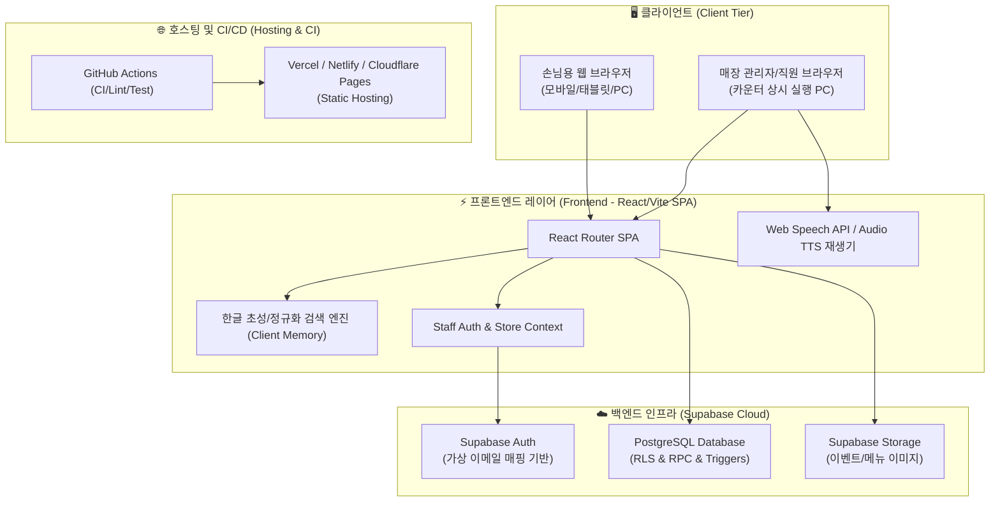
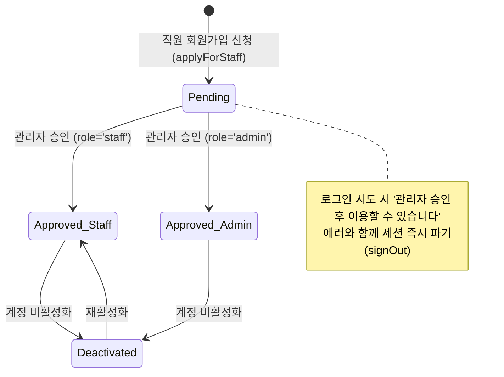

# 시스템 아키텍처 및 인프라 명세 (System Architecture & Infrastructure)

본 문서는 **카툰플러스(CartoonPlus)** 서비스의 전체 시스템 구조, 기술 스택, 인프라 배포 환경 및 보안/데이터 파이프라인을 신규 개발자가 한눈에 파악할 수 있도록 정리한 기술 문서입니다.

---

## 1. 시스템 전체 구성도 (High-Level Architecture)

카툰플러스는 정적 호스팅(SPA) 프론트엔드와 Supabase 기반의 BaaS(Backend as a Service) 아키텍처로 구축되어 있습니다.

---

## 2. 기술 스택 요약 (Tech Stack)

| 구분                   | 기술 / 라이브러리                  | 적용 목적 및 설명                                                       |
| :--------------------- | :--------------------------------- | :---------------------------------------------------------------------- |
| **Frontend Framework** | `React 18`, `TypeScript`           | 안정적인 타입 시스템과 컴포넌트 기반 UI 개발                            |
| **Build & Bundler**    | `Vite` + `Node.js SSG Generator`   | 초고속 HMR 및 20개 공개/지점별 경로 사전 HTML 렌더링 (SSG)              |
| **Routing**            | `React Router v6` (History API)    | 손님용 / 직원용 / 관리자용 라우트 제어 및 `/stores/:slug` 딥링크 지원    |
| **Styling & Icons**    | `Tailwind CSS`, `Lucide React`     | 유틸리티 퍼스트 CSS를 통한 반응형 디자인 및 직관적 아이콘셋             |
| **Backend & DB**       | `Supabase` (PostgreSQL 15+)        | RDBMS, 행 단위 보안(RLS), Stored Procedures(RPC), 실시간 인증           |
| **Auth**               | `Supabase Auth`                    | 직원/관리자 인증 (아이디를 내부 가상 이메일로 투명 변환, 지점별 권한)  |
| **Testing**            | `Vitest`, `Testing Library`        | 핵심 유틸리티(검색, 스케줄러, CSV 파서) 및 UI 컴포넌트 단위/통합 테스트 |
| **Voice / Broadcast**  | `Web Speech API` & `MP3 Assets`    | 고음질 프리셋 오디오 및 브라우저 TTS 하이브리드 자동 방송 엔진          |

---

## 3. 인프라 및 배포 환경 (Infrastructure & Hosting)

### 3.1. 프론트엔드 정적 호스팅 및 SSG (Static Site Generation)

- **빌드 산출물**: 정적 HTML 및 번들 에셋 (`dist/` 디렉터리: 20개 SSG 페이지, `sitemap.xml`, `robots.txt`, `_routes.json`)
- **SSG 빌드 스크립트**: `scripts/generate-ssg.js`가 빌드 시점에 각 공개 라우트별 `index.html`을 사전 생성하여 검색엔진 크롤링 및 초기 로딩 최적화.
- **SPA 라우팅 및 딥링크 처리**: Cloudflare Pages / GitHub Pages / Vercel 환경에서 `_routes.json` 또는 `404.html` ➔ `/index.html` fallback을 지원하며 History API 인터셉터가 클라이언트 라우팅을 유지.
- **환경 변수 관리 (`.env.local`)**:
  - `VITE_SUPABASE_URL`: Supabase 프로젝트 엔드포인트 URL
  - `VITE_SUPABASE_ANON_KEY`: 클라이언트 공개용 익명(Anon) Key

### 3.2. 백엔드 및 데이터베이스 (Supabase BaaS)

- **리전**: AWS 아시아 태평양 (서울 / `ap-northeast-2`)
- **보안 격리**: PostgreSQL의 **Row-Level Security (RLS)** 기능을 활용하여 클라이언트에서 직접 쿼리하되, 권한 없는 데이터 변조를 원천 차단.
- **RPC 함수**: `upsert_inventory_for_store`, `apply_for_staff_account` 등 복합 비즈니스 로직 및 권한 검증을 서버사이드 Stored Procedure로 처리.

---

## 4. 보안 및 인증 모델 (Security & Authorization)

### 4.1. 가상 이메일 매핑 기반 인증 (Virtual Email Mapping)

- **배경**: 매장 직원/알바생은 업무 시 개인 이메일 대신 간단한 **아이디 (`loginId`)**로 로그인하기를 원함.
- **구현 방식**:
  - 사용자 입력: `staff01` ➔ 내부 변환: `staff01@cartoonplus.internal`
  - Supabase Auth는 내부 이메일 형태로 가입 및 세션을 처리하여 별도의 SMTP 설정 없이 간편한 아이디/비밀번호 로그인을 지원합니다.

### 4.2. 직원 계정 라이프사이클 및 권한 파이프라인

1. **가입 신청 (`pending`)**: `apply_for_staff_account` RPC를 호출하여 `staff_accounts` 테이블에 대기 상태로 등록.
2. **관리자 승인 (`approved`)**: 관리자가 `AdminAccountsPage`에서 승인하고 지점 (`store_id`) 및 역할 (`staff` or `admin`)을 부여.
3. **접근 제어**: 로그인 성공 시 `staff_accounts.status === 'approved'` 검증 후 세션 유지, 미승인 시 즉시 강제 로그아웃.

### 4.3. Row Level Security (RLS) 원칙

- **손님 (Public/Anon)**:
  - 도서 (`books`), 재고 (`book_inventories`), 활성 이벤트 (`store_events`), 메뉴 (`menu_items`)는 **SELECT**만 가능.
  - 도서 입고 신청 (`book_requests`)은 **INSERT**만 가능.
- **승인된 직원 (Staff/Admin)**:
  - 소속 지점의 재고, 이벤트, 게임, 방송 스케줄에 대해 **SELECT / INSERT / UPDATE / DELETE** 권한 보유.
- **최고 관리자 (Admin)**:
  - 직원 계정 승인 및 권한 변경 (`staff_accounts`), 지점 마스터 정보 수정 권한 보유.

---

## 5. 지점별 다중 매장 데이터 격리 (Multi-Store Scoping)

- 카툰플러스는 다중 지점 (서울대입구역점 `snu`, 잠실점 `jamsil`, 홍대점 `hongdae` 등)을 지원합니다.
- 모든 운영 테이블 (`book_inventories`, `store_events`, `scheduled_broadcasts` 등)은 `store_id` 외래키를 필수 컬럼으로 가집니다.
- **클라이언트 컨텍스트**:
  - 손님 화면: URL Path 또는 `StoreContext`를 통해 현재 지점의 데이터만 조회.
  - 직원 화면: 로그인된 직원의 소속 `store_id` (`StaffStoreContext`)에 맞추어 데이터가 자동 필터링됩니다.
