<aside>
🗄️

**카툰플러스 (CartoonPlus Cafe) Data 모델링**

ERD, 테이블 명세, 관계, 인덱스 및 정규화 검색 전략을 함께 관리합니다.

</aside>

## 🧭 ERD

```mermaid
erDiagram
    STORES ||--o{ BOOK_INVENTORIES : "지점별 재고 보유"
    STORES ||--o{ ENTERTAINMENT_ITEMS : "구비 게임/보드게임"
    STORES ||--o{ MENU_ITEMS : "판매 메뉴/요금"
    STORES ||--o{ BROADCAST_PRESETS : "매장 방송 멘트"
    STORES ||--o{ ADMIN_USERS : "소속 직원/관리자"
    STORES ||--o{ NOTICES : "매장별 공지/이벤트"
    STORES ||--o{ BOOK_REQUESTS : "지점별 도서 입고 신청"

    BOOKS ||--o{ BOOK_INVENTORIES : "도서 마스터 매핑"

    STORES {
        VARCHAR(20) id PK "지점 코드 (snu, jamsil)"
        VARCHAR(50) name "지점명 (서울대입구역점, 잠실점)"
        VARCHAR(255) address "매장 도로명 주소"
        VARCHAR(30) phone "전화번호"
        VARCHAR(100) hours "영업시간"
        VARCHAR(255) parking "주차 안내 정보"
        BOOLEAN is_active "운영 활성화 여부"
        TIMESTAMP created_at "등록일시"
    }

    BOOKS {
        UUID id PK "도서 고유 ID"
        VARCHAR(150) title "도서명 원문 (체인소 맨)"
        VARCHAR(150) normalized_title "공백/특수문자 제거 정규화 제목 (체인소맨)"
        VARCHAR(100) initial_consonants "한글 초성 (ㅊㅇㅅㅁ)"
        VARCHAR(100) author "작가명"
        VARCHAR(100) publisher "출판사"
        VARCHAR(50) category "장르 (웹툰/코믹스/순정/액션 등)"
        BOOLEAN is_deleted "소프트 삭제 여부"
        TIMESTAMP created_at "등록일시"
        TIMESTAMP updated_at "수정일시"
    }

    BOOK_INVENTORIES {
        UUID id PK "재고 고유 ID"
        VARCHAR(20) store_id FK "지점 ID (STORES.id)"
        UUID book_id FK "도서 ID (BOOKS.id)"
        VARCHAR(50) volume_range "보유 권수 (예: 1~16권)"
        VARCHAR(50) shelf_location "서가 위치 텍스트 (예: A-05 서가)"
        VARCHAR(255) note "특이사항/메모 (예: 3권 훼손 보수중)"
        TIMESTAMP updated_at "재고 최종 수정일시"
    }

    BOOK_REQUESTS {
        UUID id PK "신청 고유 ID"
        VARCHAR(20) store_id FK "희망 지점 ID (STORES.id)"
        VARCHAR(150) title "신청 도서명 (필수)"
        VARCHAR(100) author "작가/출판사 (선택)"
        VARCHAR(50) volume_range "희망 권수 (예: 1~5권, 전권)"
        VARCHAR(255) user_comment "신청 사유 / 손님 한마디"
        VARCHAR(20) status "상태 (PENDING | ORDERED | COMPLETED | REJECTED)"
        VARCHAR(255) admin_reply "관리자 검토 메모/답변"
        TIMESTAMP created_at "신청일시"
        TIMESTAMP updated_at "상태 변경일시"
    }

    ENTERTAINMENT_ITEMS {
        UUID id PK "아이템 ID"
        VARCHAR(20) store_id FK "지점 ID (STORES.id)"
        VARCHAR(20) type "종류 (NINTENDO | XBOX | BOARD_GAME)"
        VARCHAR(100) title "타이틀명 (마리오 카트 8, 루미큐브 등)"
        VARCHAR(50) genre "장르/카테고리"
        VARCHAR(50) players "지원 인원 (1~4인 플레이 등)"
        VARCHAR(20) difficulty "난이도 (초급/중급/고급 - 보드게임용)"
        BOOLEAN is_available "이용 가능 여부 (대여가능/수리중)"
        INT sort_order "정렬 순서"
        TIMESTAMP created_at "등록일시"
    }

    MENU_ITEMS {
        UUID id PK "메뉴 ID"
        VARCHAR(20) store_id FK "지점 ID (STORES.id)"
        VARCHAR(20) category "카테고리 (MEAL | SNACK | BEV | PACKAGE)"
        VARCHAR(100) name "메뉴명/요금제명"
        VARCHAR(255) description "메뉴 설명"
        INT price "가격 (원 단위)"
        BOOLEAN is_best "인기 BEST 여부"
        BOOLEAN is_soldout "품절 여부"
        INT sort_order "정렬 순서"
        TIMESTAMP created_at "등록일시"
    }

    BROADCAST_PRESETS {
        UUID id PK "프리셋 ID"
        VARCHAR(20) store_id FK "지점 ID (공통일 경우 NULL 또는 'ALL')"
        VARCHAR(30) preset_key "식별 키 (drinkReady, idCheck, closing10 등)"
        VARCHAR(50) title "버튼 타이틀 (음료 제작 완료 등)"
        TEXT message_text "TTS 음성 출력 텍스트"
        INT sort_order "노출 순서"
        TIMESTAMP created_at "등록일시"
    }

    ADMIN_USERS {
        UUID id PK "관리자 ID"
        VARCHAR(20) store_id FK "소속 지점 ID"
        VARCHAR(50) username "로그인 아이디 / 이름"
        VARCHAR(255) password_hash "암호화된 비밀번호"
        VARCHAR(20) role "권한 (ADMIN | STAFF)"
        TIMESTAMP last_login_at "최근 로그인 일시"
        TIMESTAMP created_at "계정 생성일시"
    }

    NOTICES {
        UUID id PK "공지 ID"
        VARCHAR(20) store_id FK "지점 ID"
        VARCHAR(150) title "공지/이벤트 제목"
        TEXT content "내용"
        VARCHAR(20) type "유형 (NOTICE | EVENT | NEW_BOOK)"
        BOOLEAN is_active "게시 여부"
        TIMESTAMP created_at "작성일시"
    }
```



---

## 🧱 테이블 목록

| 테이블명 | 설명 | 주요 컬럼 |
| :--- | :--- | :--- |
| `stores` | 매장 지점 마스터 정보 | `id`, `name`, `address`, `phone`, `hours` |
| `books` | 도서 메타데이터 마스터 (제목/권수 분리, 정규화 검색 지원) | `id`, `title`, `normalized_title`, `initial_consonants`, `author`, `publisher`, `category` |
| `book_inventories` | 지점별 도서 보유 권수 및 서가 위치 관리 | `id`, `store_id`, `book_id`, `volume_range`, `shelf_location` |
| `book_requests` | **손님 도서 입고 신청 및 관리자 접수/처리 내역** | `id`, `store_id`, `title`, `author`, `status`, `admin_reply` |
| `entertainment_items` | 닌텐도/Xbox 게임 팩 및 보드게임 카탈로그 | `id`, `store_id`, `type`, `title`, `players`, `is_available` |
| `menu_items` | F&B 식음료 메뉴 및 이용 요금제 | `id`, `store_id`, `category`, `name`, `price`, `is_best` |
| `broadcast_presets` | 원클릭 매장 안내 방송(TTS) 멘트 정의 | `id`, `store_id`, `preset_key`, `title`, `message_text` |
| `admin_users` | 매장 직원 및 점주 인증 계정 (이름 + 비밀번호) | `id`, `store_id`, `username`, `password_hash`, `role` |
| `notices` | 지점별 공지사항 및 이벤트 안내 | `id`, `store_id`, `title`, `content`, `type`, `is_active` |

---

## 📑 테이블 상세 명세

### 1. `stores` (지점 정보)

| 컬럼 | 타입 | Null | 기본값 | PK/FK | 설명 |
| :--- | :--- | :---: | :---: | :---: | :--- |
| `id` | VARCHAR(20) | NO | - | **PK** | 지점 고유 코드 (`snu`: 서울대입구점, `jamsil`: 잠실점) |
| `name` | VARCHAR(50) | NO | - | - | 지점 명칭 (예: `서울대입구역점`) |
| `address` | VARCHAR(255) | NO | - | - | 매장 도로명 주소 (`서울 관악구 관악로 155 3층` 등) |
| `phone` | VARCHAR(30) | NO | - | - | 매장 대표 전화번호 |
| `hours` | VARCHAR(100) | NO | - | - | 매장 운영 시간 안내 문구 |
| `parking` | VARCHAR(255) | YES | NULL | - | 주차 지원 안내 텍스트 |
| `is_active` | BOOLEAN | NO | TRUE | - | 지점 서비스 운영 활성화 여부 |
| `created_at` | TIMESTAMP WITH TIME ZONE | NO | NOW() | - | 레코드 생성 일시 |

---

### 2. `books` (도서 마스터)

| 컬럼 | 타입 | Null | 기본값 | PK/FK | 설명 |
| :--- | :--- | :---: | :---: | :---: | :--- |
| `id` | UUID | NO | gen_random_uuid() | **PK** | 도서 고유 식별자 |
| `title` | VARCHAR(150) | NO | - | - | 도서명 원문 (예: `체인소 맨`) |
| `normalized_title` | VARCHAR(150) | NO | - | - | **공백/특수문자 제거 정규화 제목** (예: `체인소맨`) |
| `initial_consonants`| VARCHAR(100) | YES | NULL | - | **한글 초성 인덱스** (예: `ㅊㅇㅅㅁ`) |
| `author` | VARCHAR(100) | NO | '미상' | - | 작가 / 글·그림 |
| `publisher` | VARCHAR(100) | YES | NULL | - | 출판사명 (예: `학산문화사`, `서울미디어코믹스`) |
| `category` | VARCHAR(50) | NO | '코믹스' | - | 도서 장르 (`웹툰`, `코믹스`, `순정`, `액션/판타지`, `소설/라노벨`) |
| `is_deleted` | BOOLEAN | NO | FALSE | - | 소프트 삭제 플래그 |
| `created_at` | TIMESTAMP WITH TIME ZONE | NO | NOW() | - | 등록 일시 |
| `updated_at` | TIMESTAMP WITH TIME ZONE | NO | NOW() | - | 정보 수정 일시 |

---

### 3. `book_inventories` (지점별 도서 재고)

| 컬럼 | 타입 | Null | 기본값 | PK/FK | 설명 |
| :--- | :--- | :---: | :---: | :---: | :--- |
| `id` | UUID | NO | gen_random_uuid() | **PK** | 재고 레코드 고유 ID |
| `store_id` | VARCHAR(20) | NO | - | **FK** | 지점 코드 (`stores.id` 참조) |
| `book_id` | UUID | NO | - | **FK** | 도서 마스터 ID (`books.id` 참조) |
| `volume_range` | VARCHAR(50) | NO | '1권' | - | **보유 권수 범위** (예: `1 ~ 23권`, `1 ~ 16권`) |
| `shelf_location` | VARCHAR(50) | NO | '카운터 문의' | - | **서가 위치 텍스트** (예: `A-03 서가 (소년만화)`) |
| `note` | VARCHAR(255) | YES | NULL | - | 매장 관리자용 메모 (예: `12권 파손 재입고 대기`) |
| `updated_at` | TIMESTAMP WITH TIME ZONE | NO | NOW() | - | 재고 최종 갱신 일시 |

---

### 4. `book_requests` (도서 입고 신청)

| 컬럼 | 타입 | Null | 기본값 | PK/FK | 설명 |
| :--- | :--- | :---: | :---: | :---: | :--- |
| `id` | UUID | NO | gen_random_uuid() | **PK** | 입고 신청 고유 ID |
| `store_id` | VARCHAR(20) | NO | - | **FK** | 희망 입고 지점 코드 (`stores.id` 참조) |
| `title` | VARCHAR(150) | NO | - | - | **신청 도서명 (필수)** |
| `author` | VARCHAR(100) | YES | NULL | - | 작가 / 출판사 (선택) |
| `volume_range` | VARCHAR(50) | YES | NULL | - | 희망 권수 (예: `1~5권`, `전권`, `최신권`) |
| `user_comment` | VARCHAR(255) | YES | NULL | - | 신청 사유 / 손님 코멘트 |
| `status` | VARCHAR(20) | NO | 'PENDING' | - | **처리 상태** (`PENDING`: 접수/검토중, `ORDERED`: 주문완료/입고예정, `COMPLETED`: 입고완료, `REJECTED`: 입고불가/절판) |
| `admin_reply` | VARCHAR(255) | YES | NULL | - | 관리자 검토 메모 및 손님 답변 |
| `created_at` | TIMESTAMP WITH TIME ZONE | NO | NOW() | - | 신청 일시 |
| `updated_at` | TIMESTAMP WITH TIME ZONE | NO | NOW() | - | 상태 변경 일시 |

---

### 5. `entertainment_items` (게임/보드게임 카탈로그)

| 컬럼 | 타입 | Null | 기본값 | PK/FK | 설명 |
| :--- | :--- | :---: | :---: | :---: | :--- |
| `id` | UUID | NO | gen_random_uuid() | **PK** | 게임 아이템 고유 ID |
| `store_id` | VARCHAR(20) | NO | - | **FK** | 지점 코드 (`stores.id` 참조) |
| `type` | VARCHAR(20) | NO | - | - | 종류 (`NINTENDO`, `XBOX`, `BOARD_GAME`) |
| `title` | VARCHAR(100) | NO | - | - | 타이틀명 (예: `마리오 카트 8 디럭스`, `루미큐브`) |
| `genre` | VARCHAR(50) | YES | NULL | - | 게임 장르 (예: `레이싱/파티`, `전략/보석수집`) |
| `players` | VARCHAR(50) | NO | '1~4인' | - | 플레이 권장 인원 (예: `1~4인 플레이`, `2인 필수`) |
| `difficulty` | VARCHAR(20) | YES | NULL | - | 보드게임 난이도 (`초급`, `중급`, `고급`) |
| `is_available` | BOOLEAN | NO | TRUE | - | 매장 구비 및 대여 가능 여부 |
| `sort_order` | INT | NO | 0 | - | 목록 노출 우선순위 정렬값 |
| `created_at` | TIMESTAMP WITH TIME ZONE | NO | NOW() | - | 등록 일시 |

---

### 6. `menu_items` (식음료 메뉴 및 요금제)

| 컬럼 | 타입 | Null | 기본값 | PK/FK | 설명 |
| :--- | :--- | :---: | :---: | :---: | :--- |
| `id` | UUID | NO | gen_random_uuid() | **PK** | 메뉴 고유 ID |
| `store_id` | VARCHAR(20) | NO | - | **FK** | 지점 코드 (`stores.id` 참조) |
| `category` | VARCHAR(20) | NO | 'MEAL' | - | 카테고리 (`MEAL`: 식사, `SNACK`: 스낵, `BEV`: 음료, `PACKAGE`: 요금제) |
| `name` | VARCHAR(100) | NO | - | - | 메뉴명 / 요금제명 (예: `칼칼 신라면 + 계란`, `2시간+음료`) |
| `description` | VARCHAR(255) | YES | NULL | - | 메뉴 특징 및 상세 설명 |
| `price` | INT | NO | 0 | - | 가격 (원 단위, 예: `4500`, `10000`) |
| `is_best` | BOOLEAN | NO | FALSE | - | 인기 메뉴 BEST 배지 표시 여부 |
| `is_soldout` | BOOLEAN | NO | FALSE | - | 품절/매진 여부 |
| `sort_order` | INT | NO | 0 | - | 노출 순서 |
| `created_at` | TIMESTAMP WITH TIME ZONE | NO | NOW() | - | 등록 일시 |

---

### 7. `broadcast_presets` (매장 안내 방송 멘트)

| 컬럼 | 타입 | Null | 기본값 | PK/FK | 설명 |
| :--- | :--- | :---: | :---: | :---: | :--- |
| `id` | UUID | NO | gen_random_uuid() | **PK** | 방송 프리셋 고유 ID |
| `store_id` | VARCHAR(20) | YES | NULL | **FK** | 지점 코드 (공통 멘트일 경우 NULL) |
| `preset_key` | VARCHAR(30) | NO | - | - | 멘트 식별자 (`drinkReady`, `idCheck`, `closing30`, `closing10`, `noFood`, `quiet`) |
| `title` | VARCHAR(50) | NO | - | - | 버튼 표기명 (예: `☕ 음료 제작 완료`, `🪪 10시 신분증 검사`) |
| `message_text` | TEXT | NO | - | - | TTS 엔진으로 송출될 한국어 안내 방송 스크립트 |
| `sort_order` | INT | NO | 0 | - | 관리자 콘솔 버튼 노출 순서 |
| `created_at` | TIMESTAMP WITH TIME ZONE | NO | NOW() | - | 등록 일시 |

---

### 8. `admin_users` (관리자 계정 - 이름/아이디 + 비밀번호)

| 컬럼 | 타입 | Null | 기본값 | PK/FK | 설명 |
| :--- | :--- | :---: | :---: | :---: | :--- |
| `id` | UUID | NO | gen_random_uuid() | **PK** | 관리자 계정 ID |
| `store_id` | VARCHAR(20) | NO | - | **FK** | 소속 지점 코드 (`stores.id` 참조) |
| `username` | VARCHAR(50) | NO | - | - | **로그인 아이디 / 직원이름** (예: `snu_staff`, `잠실점매니저`) |
| `password_hash` | VARCHAR(255) | NO | - | - | 단방향 암호화된 비밀번호 (BCrypt) |
| `role` | VARCHAR(20) | NO | 'STAFF' | - | 계정 권한 (`ADMIN`: 점주/총괄, `STAFF`: 매장 직원) |
| `last_login_at` | TIMESTAMP WITH TIME ZONE | YES | NULL | - | 최근 로그인 일시 |
| `created_at` | TIMESTAMP WITH TIME ZONE | NO | NOW() | - | 계정 생성 일시 |

---

### 9. `notices` (공지 및 이벤트)

| 컬럼 | 타입 | Null | 기본값 | PK/FK | 설명 |
| :--- | :--- | :---: | :---: | :---: | :--- |
| `id` | UUID | NO | gen_random_uuid() | **PK** | 공지 ID |
| `store_id` | VARCHAR(20) | NO | - | **FK** | 지점 코드 (`stores.id` 참조) |
| `title` | VARCHAR(150) | NO | - | - | 공지/이벤트 제목 |
| `content` | TEXT | NO | - | - | 상세 내용 |
| `type` | VARCHAR(20) | NO | 'NOTICE' | - | 유형 (`NOTICE`: 일반공지, `EVENT`: 이벤트, `NEW_BOOK`: 신간안내) |
| `is_active` | BOOLEAN | NO | TRUE | - | 노출 활성화 여부 |
| `created_at` | TIMESTAMP WITH TIME ZONE | NO | NOW() | - | 작성 일시 |

---

## 🔗 관계 정의 (Relationship Rules)

1. **`STORES` : `BOOK_INVENTORIES` = 1 : N**
   - 하나의 지점은 여러 권의 도서 재고를 가질 수 있다.
2. **`BOOKS` : `BOOK_INVENTORIES` = 1 : N**
   - 도서 마스터 1권은 여러 지점에 각각 독립된 재고(권수, 서가 번호)로 매핑된다.
   - `(store_id, book_id)`는 복합 유니크(Unique) 제약조건을 가져 중복을 방지한다.
3. **`STORES` : `BOOK_REQUESTS` = 1 : N**
   - 손님이 특정 지점을 지정하여 도서 입고를 신청하며, 해당 지점 직원이 접수/처리한다.
4. **`STORES` : `ENTERTAINMENT_ITEMS` / `MENU_ITEMS` = 1 : N**
   - 각 지점별로 구비된 게임 타이틀 및 판매 메뉴가 독립적으로 관리된다.
5. **`STORES` : `ADMIN_USERS` = 1 : N**
   - 직원은 특정 지점에 소속되어 이름과 비밀번호로 로그인하여 재고/신청/방송을 제어한다.

---

## 🔍 인덱스 및 성능 전략 (Index & Performance)

### 1. 공백 무시 & 초성 검색 가속 인덱스
```sql
-- 1) 공백 무시 검색용 정규화 인덱스 (B-Tree)
CREATE INDEX idx_books_normalized_title ON books (normalized_title varchar_pattern_ops);
CREATE INDEX idx_books_author ON books (author);
CREATE INDEX idx_books_initial ON books (initial_consonants);

-- 2) 도서 장르 필터 인덱스
CREATE INDEX idx_books_category ON books (category) WHERE is_deleted = FALSE;
```

### 2. 지점별 재고 및 입고 신청 인덱스
```sql
-- 지점별 도서 중복 등록 방지 및 초고속 재고 조인
CREATE UNIQUE INDEX uq_store_book_inventory ON book_inventories (store_id, book_id);
CREATE INDEX idx_inventory_shelf ON book_inventories (store_id, shelf_location);

-- 지점별 도서 입고 신청 조회 인덱스 (상태별, 최신순)
CREATE INDEX idx_book_requests_store_status ON book_requests (store_id, status, created_at DESC);
```

### 3. 카탈로그 및 메뉴 정렬 인덱스
```sql
CREATE INDEX idx_entertainment_lookup ON entertainment_items (store_id, type, sort_order);
CREATE INDEX idx_menu_lookup ON menu_items (store_id, category, sort_order);
```

---

## 🛡️ Soft Delete 정책 & 데이터 라이프사이클

1. **소프트 삭제 (Soft Delete) 적용 대상**:
   - `books` (도서 마스터): 폐간/삭제 시 `is_deleted = TRUE`로 마킹하여 과거 재고 이력 및 통계의 외래키 참조 무결성을 보존한다.
2. **도서 입고 신청(`book_requests`) 라이프사이클**:
   - 손님 등록 시 기본 상태: `PENDING` (접수/검토중)
   - 관리자 도서 발주 시: `ORDERED` (주문완료/입고예정)
   - 매장 도서 등록 완료 시: `COMPLETED` (입고완료 $\rightarrow$ 신규 도서 등록 모달과 자동 연계)
   - 절판/미출간 등으로 입고 불가 시: `REJECTED` (사유 `admin_reply` 기재)

---

## 🧪 초기 시드(Seed) 데이터 정의

```sql
-- 1. 지점 데이터 등록 (실제 매장 주소 및 정확한 운영시간 반영)
INSERT INTO stores (id, name, address, phone, hours, parking) VALUES
('snu', '서울대입구역점', '서울 관악구 관악로 155 3층', '02-888-1234', '매일 10:00 ~ 23:00 (연중무휴)', '주차 안내 카운터 문의'),
('jamsil', '잠실점', '서울 송파구 백제고분로9길 23 2층', '02-412-5678', '월~목 10:00~23:00 / 금 10:00~24:00 / 토 24시간 / 일 ~23:00', '인근 유료 주차장 지원');

-- 2. 기본 방송 프리셋 멘트 등록
INSERT INTO broadcast_presets (preset_key, title, message_text, sort_order) VALUES
('drinkReady', '☕ 음료 제작 완료', '주문하신 음료와 음식이 준비되었습니다. 카운터 픽업대로 와주시기 바랍니다. 감사합니다.', 1),
('idCheck', '🪪 밤 10시 신분증 검사', '안내 말씀 드립니다. 청소년 보호법에 따라 밤 10시 이후 미성년자의 매장 이용이 제한됩니다. 직원에게 신분증 확인을 부탁드립니다.', 2),
('closing30', '🌙 마감 30분 전', '고객 여러분 안녕하십니까. 저희 카툰플러스 마감 30분 전입니다. 이용 중이신 좌석 정리 및 퇴장 준비를 부탁드립니다.', 3),
('closing10', '⏰ 마감 10분 전', '고객 여러분 안녕하십니까. 영업 마감 10분 전입니다. 소지품을 확인해 주시고 보신 도서는 도서 반납대로 반납해 주시기 바랍니다.', 4),
('noFood', '🚫 외부음식 제한', '안내 말씀 드립니다. 쾌적한 매장 환경 유지를 위해 외부 음식물 반입 및 취식을 엄격히 금지하고 있습니다. 협조 부탁드립니다.', 5),
('quiet', '🤫 정숙/소음 주의', '안내 말씀 드립니다. 카툰플러스는 모두가 함께 쉬어가는 공간입니다. 타 이용자를 배려하여 큰 소리 대화나 전자기기 소음을 자제해 주시기 바랍니다.', 6);
```
