<aside>
🗄️

**카툰플러스 (CartoonPlus Cafe) Data 모델링**

ERD, 테이블 명세, 관계, 인덱스, 예약 방송/실행 이력 및 매장 전용 6종 프리셋 시드 데이터를 함께 관리합니다.

</aside>

## 🧭 ERD

```mermaid
erDiagram
    STORES ||--o{ BOOK_INVENTORIES : "지점별 재고 보유"
    STORES ||--o{ ENTERTAINMENT_ITEMS : "구비 게임/보드게임"
    STORES ||--o{ MENU_ITEMS : "판매 메뉴/요금"
    STORES ||--o{ BROADCAST_PRESETS : "매장 방송 프리셋"
    STORES ||--o{ SCHEDULED_BROADCASTS : "예약 방송 설정"
    STORES ||--o{ BROADCAST_RUNS : "방송 실행 기록"
    STORES ||--o{ ADMIN_USERS : "소속 직원/관리자"
    STORES ||--o{ STORE_EVENTS : "매장별 이벤트"
    STORES ||--o{ BOOK_REQUESTS : "지점별 도서 입고 신청"

    BOOKS ||--o{ BOOK_INVENTORIES : "도서 마스터 매핑"
    BROADCAST_PRESETS ||--o{ SCHEDULED_BROADCASTS : "프리셋 참조"
    SCHEDULED_BROADCASTS ||--o{ BROADCAST_RUNS : "실행 이력"

    STORES {
        VARCHAR(20) id PK "지점 코드 (snu, jamsil)"
        VARCHAR(50) name "지점명 (서울대입구역점, 잠실점)"
        VARCHAR(255) address "매장 도로명 주소"
        VARCHAR(30) phone "전화번호"
        VARCHAR(100) hours "영업시간"
        VARCHAR(255) parking "주차 안내 정보"
        BOOLEAN is_active "운영 활성화 여부"
        TIMESTAMP created_at "등록일시"
    }

    BOOKS {
        UUID id PK "도서 고유 ID"
        VARCHAR(150) title "도서명 원문 (체인소 맨)"
        VARCHAR(150) normalized_title "공백/특수문자 제거 정규화 제목 (체인소맨)"
        VARCHAR(100) initial_consonants "한글 초성 (ㅊㅇㅅㅁ)"
        VARCHAR(100) author "작가명"
        VARCHAR(100) publisher "출판사"
        VARCHAR(50) category "장르 (웹툰/코믹스/순정/액션 등)"
        BOOLEAN is_archived "보관(아카이브) 여부"
        TIMESTAMP created_at "등록일시"
        TIMESTAMP updated_at "수정일시"
    }

    BOOK_INVENTORIES {
        UUID id PK "재고 고유 ID"
        VARCHAR(20) store_id FK "지점 ID (STORES.id)"
        UUID book_id FK "도서 ID (BOOKS.id)"
        VARCHAR(50) volume_range "보유 권수 (예: 1~16권)"
        VARCHAR(50) shelf_location "서가 위치 텍스트 (예: A-05 서가)"
        VARCHAR(255) note "특이사항/메모"
        BOOLEAN is_archived "보관(아카이브) 여부"
        TIMESTAMP first_registered_at "최초 등록일시 (30일 신간 기준)"
        TIMESTAMP updated_at "재고 최종 수정일시"
    }

    BOOK_REQUESTS {
        UUID id PK "신청 고유 ID"
        VARCHAR(20) store_id FK "희망 지점 ID (STORES.id)"
        VARCHAR(150) title "신청 도서명 (필수)"
        VARCHAR(100) author "작가/출판사 (선택)"
        VARCHAR(50) volume_range "희망 권수 (선택)"
        VARCHAR(255) user_comment "신청 사유 / 손님 한마디"
        VARCHAR(20) status "상태 (PENDING | ORDERED | COMPLETED | REJECTED)"
        VARCHAR(255) admin_reply "관리자 검토 메모/답변"
        TIMESTAMP created_at "신청일시"
        TIMESTAMP updated_at "상태 변경일시"
    }

    ENTERTAINMENT_ITEMS {
        UUID id PK "아이템 ID"
        VARCHAR(20) store_id FK "지점 ID (STORES.id)"
        VARCHAR(20) type "종류 (NINTENDO | PLAYSTATION_4 | XBOX | BOARD_GAME)"
        VARCHAR(100) title "타이틀명"
        VARCHAR(50) genre "장르/카테고리"
        VARCHAR(50) players "지원 인원"
        VARCHAR(20) difficulty "난이도"
        BOOLEAN is_verified "실물 검증 완료 여부"
        BOOLEAN is_archived "보관 여부"
        INT sort_order "정렬 순서"
        TIMESTAMP created_at "등록일시"
    }

    STORE_EVENTS {
        UUID id PK "이벤트 ID"
        VARCHAR(20) store_id FK "지점 ID"
        VARCHAR(150) title "이벤트 제목"
        TEXT content "상세 내용"
        VARCHAR(255) image_url "배너 이미지 경로"
        DATE start_date "시작일"
        DATE end_date "종료일 (익일부터 자동 숨김)"
        BOOLEAN is_active "공개 여부"
        BOOLEAN is_archived "보관 여부"
        TIMESTAMP created_at "작성일시"
    }

    MENU_ITEMS {
        UUID id PK "메뉴 ID"
        VARCHAR(20) store_id FK "지점 ID"
        VARCHAR(20) category "카테고리 (MEAL | SNACK | BEV | PACKAGE)"
        VARCHAR(100) name "메뉴명/요금제명"
        VARCHAR(255) description "메뉴 설명"
        INT price "가격 (원 단위)"
        BOOLEAN is_best "인기 BEST 여부"
        BOOLEAN is_soldout "품절 여부"
        INT sort_order "정렬 순서"
        TIMESTAMP created_at "등록일시"
    }

    BROADCAST_PRESETS {
        UUID id PK "프리셋 ID"
        VARCHAR(20) store_id FK "지점 ID (공통 NULL)"
        VARCHAR(30) preset_key "식별 키 (drinkReady, idCheck, returnGame 등)"
        VARCHAR(50) title "버튼 표기명"
        TEXT message_text "TTS 음성 출력 텍스트"
        INT sort_order "노출 순서"
        TIMESTAMP created_at "등록일시"
    }

    SCHEDULED_BROADCASTS {
        UUID id PK "예약 ID"
        VARCHAR(20) store_id FK "지점 ID"
        VARCHAR(30) preset_key FK "프리셋 키 (또는 커스텀)"
        TEXT custom_text "커스텀 텍스트 (프리셋 없을 때)"
        VARCHAR(20) schedule_type "스케줄 타입 (DAILY | WEEKDAYS | ONE_TIME)"
        VARCHAR(20) target_time "송출 시각 (HH:mm)"
        VARCHAR(20) target_days "요일 (예: MON,TUE,WED / 선택)"
        DATE target_date "특정일 (1회성일 때)"
        BOOLEAN is_enabled "활성화 여부"
        BOOLEAN is_archived "보관 여부"
        TIMESTAMP created_at "등록일시"
    }

    BROADCAST_RUNS {
        UUID id PK "실행 이력 ID"
        VARCHAR(20) store_id FK "지점 ID"
        UUID scheduled_broadcast_id FK "예약 ID (수동일 경우 NULL)"
        TEXT broadcast_text "실제 송출된 텍스트"
        VARCHAR(20) trigger_type "트리거 유형 (MANUAL_PRESET | MANUAL_CUSTOM | SCHEDULED)"
        VARCHAR(20) status "상태 (PENDING | SUCCESS | FAILURE)"
        TEXT error_message "오류 원인 (실패 시)"
        TIMESTAMP triggered_at "송출 시각"
    }

    ADMIN_USERS {
        UUID id PK "직원/관리자 ID"
        VARCHAR(20) store_id FK "소속 지점 ID"
        VARCHAR(50) name "직원 실명"
        VARCHAR(50) login_id "로그인 ID"
        VARCHAR(4) phone_last4 "휴대폰 번호 뒷 4자리"
        VARCHAR(255) password_hash "단방향 암호화 비밀번호"
        VARCHAR(20) role "권한 (ADMIN | STAFF)"
        VARCHAR(20) status "계정 상태 (PENDING | APPROVED | DEACTIVATED)"
        TIMESTAMP approved_at "가입 승인일시"
        TIMESTAMP last_login_at "최근 로그인 일시"
        TIMESTAMP created_at "신청일시"
    }
```



---

## 📑 주요 테이블 상세 명세

### 1. `admin_users` (직원 및 관리자 계정)

| 컬럼 | 타입 | Null | 기본값 | 설명 |
| :--- | :--- | :---: | :---: | :--- |
| `id` | UUID | NO | gen_random_uuid() | 계정 고유 식별자 |
| `store_id` | VARCHAR(20) | NO | 'snu' | 소속 지점 코드 |
| `name` | VARCHAR(50) | NO | - | 직원 실명 |
| `login_id` | VARCHAR(50) | NO | - | **로그인 아이디 (Unique)** |
| `phone_last4` | VARCHAR(4) | NO | - | **휴대폰 번호 뒷 4자리 (본인 식별용)** |
| `password_hash` | VARCHAR(255) | NO | - | BCrypt 암호화 해시 |
| `role` | VARCHAR(20) | NO | 'STAFF' | `ADMIN` (점주/총괄), `STAFF` (매장 직원) |
| `status` | VARCHAR(20) | NO | 'PENDING' | `PENDING` (가입대기), `APPROVED` (승인), `DEACTIVATED` (비활성화) |
| `approved_at` | TIMESTAMP WITH TIME ZONE | YES | NULL | 관리자 승인 일시 |
| `last_login_at` | TIMESTAMP WITH TIME ZONE | YES | NULL | 최근 로그인 일시 |

---

### 2. `book_inventories` (지점별 도서 재고)

| 컬럼 | 타입 | Null | 기본값 | 설명 |
| :--- | :--- | :---: | :---: | :--- |
| `id` | UUID | NO | gen_random_uuid() | 재고 ID |
| `store_id` | VARCHAR(20) | NO | - | 지점 코드 |
| `book_id` | UUID | NO | - | 도서 마스터 ID |
| `volume_range` | VARCHAR(50) | NO | '1권' | **보유 권수 (예: 1~16권, 전권)** |
| `shelf_location` | VARCHAR(50) | NO | '카운터 문의' | **서가 위치 (예: A-05 서가)** |
| `note` | VARCHAR(255) | YES | NULL | 특이사항 메모 |
| `is_archived` | BOOLEAN | NO | FALSE | 아카이브(보관) 여부 |
| `first_registered_at` | TIMESTAMP WITH TIME ZONE | NO | NOW() | **최초 등록일시 (30일 신간 판별용)** |

---

### 3. `broadcast_presets` (매장 전용 6종 안내 방송 프리셋)

| 컬럼 | 타입 | Null | 기본값 | 설명 |
| :--- | :--- | :---: | :---: | :--- |
| `id` | UUID | NO | gen_random_uuid() | 프리셋 ID |
| `store_id` | VARCHAR(20) | YES | NULL | 지점 코드 (공통일 경우 NULL) |
| `preset_key` | VARCHAR(30) | NO | - | 식별 키 (`drinkReady`, `idCheck`, `closing30`, `closing10`, `noFood`, `quiet`, `returnGame`, `cleanRoom`) |
| `title` | VARCHAR(50) | NO | - | 버튼 타이틀 |
| `message_text` | TEXT | NO | - | TTS 발화 텍스트 |
| `sort_order` | INT | NO | 0 | 버튼 노출 순서 |

---

### 4. `scheduled_broadcasts` & `broadcast_runs` (예약 방송 및 실행 기록)

| 테이블 | 주요 컬럼 | 설명 |
| :--- | :--- | :--- |
| `scheduled_broadcasts` | `store_id`, `preset_key`, `schedule_type`, `target_time`, `target_days`, `is_enabled` | 매일/특정 요일/1회성 예약 방송 설정 |
| `broadcast_runs` | `store_id`, `broadcast_text`, `trigger_type`, `status`, `error_message`, `triggered_at` | 방송 송출 이력 (대기/성공/실패) 및 실패 시 재시도 대상 |

        VARCHAR(100) title "타이틀명"
        VARCHAR(50) genre "장르/카테고리"
        VARCHAR(50) players "지원 인원"
        VARCHAR(20) difficulty "난이도"
        BOOLEAN is_verified "실물 검증 완료 여부"
        BOOLEAN is_archived "보관 여부"
        INT sort_order "정렬 순서"
        TIMESTAMP created_at "등록일시"
    }

    STORE_EVENTS {
        UUID id PK "이벤트 ID"
        VARCHAR(20) store_id FK "지점 ID"
        VARCHAR(150) title "이벤트 제목"
        TEXT content "상세 내용"
        VARCHAR(255) image_url "배너 이미지 경로"
        DATE start_date "시작일"
        DATE end_date "종료일 (익일부터 자동 숨김)"
        BOOLEAN is_active "공개 여부"
        BOOLEAN is_archived "보관 여부"
        TIMESTAMP created_at "작성일시"
    }

    MENU_ITEMS {
        UUID id PK "메뉴 ID"
        VARCHAR(20) store_id FK "지점 ID"
        VARCHAR(20) category "카테고리 (MEAL | SNACK | BEV | PACKAGE)"
        VARCHAR(100) name "메뉴명/요금제명"
        VARCHAR(255) description "메뉴 설명"
        INT price "가격 (원 단위)"
        BOOLEAN is_best "인기 BEST 여부"
        BOOLEAN is_soldout "품절 여부"
        INT sort_order "정렬 순서"
        TIMESTAMP created_at "등록일시"
    }

    BROADCAST_PRESETS {
        UUID id PK "프리셋 ID"
        VARCHAR(20) store_id FK "지점 ID (공통 NULL)"
        VARCHAR(30) preset_key "식별 키 (drinkReady, idCheck, returnGame 등)"
        VARCHAR(50) title "버튼 표기명"
        TEXT message_text "TTS 음성 출력 텍스트"
        INT sort_order "노출 순서"
        TIMESTAMP created_at "등록일시"
    }

    SCHEDULED_BROADCASTS {
        UUID id PK "예약 ID"
        VARCHAR(20) store_id FK "지점 ID"
        VARCHAR(30) preset_key FK "프리셋 키 (또는 커스텀)"
        TEXT custom_text "커스텀 텍스트 (프리셋 없을 때)"
        VARCHAR(20) schedule_type "스케줄 타입 (DAILY | WEEKDAYS | ONE_TIME)"
        VARCHAR(20) target_time "송출 시각 (HH:mm)"
        VARCHAR(20) target_days "요일 (예: MON,TUE,WED / 선택)"
        DATE target_date "특정일 (1회성일 때)"
        BOOLEAN is_enabled "활성화 여부"
        BOOLEAN is_archived "보관 여부"
        TIMESTAMP created_at "등록일시"
    }

    BROADCAST_RUNS {
        UUID id PK "실행 이력 ID"
        VARCHAR(20) store_id FK "지점 ID"
        UUID scheduled_broadcast_id FK "예약 ID (수동일 경우 NULL)"
        TEXT broadcast_text "실제 송출된 텍스트"
        VARCHAR(20) trigger_type "트리거 유형 (MANUAL_PRESET | MANUAL_CUSTOM | SCHEDULED)"
        VARCHAR(20) status "상태 (PENDING | SUCCESS | FAILURE)"
        TEXT error_message "오류 원인 (실패 시)"
        TIMESTAMP triggered_at "송출 시각"
    }

    ADMIN_USERS {
        UUID id PK "직원/관리자 ID"
        VARCHAR(20) store_id FK "소속 지점 ID"
        VARCHAR(50) name "직원 실명"
        VARCHAR(50) login_id "로그인 ID"
        VARCHAR(4) phone_last4 "휴대폰 번호 뒷 4자리"
        VARCHAR(255) password_hash "단방향 암호화 비밀번호"
        VARCHAR(20) role "권한 (ADMIN | STAFF)"
        VARCHAR(20) status "계정 상태 (PENDING | APPROVED | DEACTIVATED)"
        TIMESTAMP approved_at "가입 승인일시"
        TIMESTAMP last_login_at "최근 로그인 일시"
        TIMESTAMP created_at "신청일시"
    }

---

## 📑 주요 테이블 상세 명세

### 1. `admin_users` (직원 및 관리자 계정)

| 컬럼 | 타입 | Null | 기본값 | 설명 |
| :--- | :--- | :---: | :---: | :--- |
| `id` | UUID | NO | gen_random_uuid() | 계정 고유 식별자 |
| `store_id` | VARCHAR(20) | NO | 'snu' | 소속 지점 코드 |
| `name` | VARCHAR(50) | NO | - | 직원 실명 |
| `login_id` | VARCHAR(50) | NO | - | **로그인 아이디 (Unique)** |
| `phone_last4` | VARCHAR(4) | NO | - | **휴대폰 번호 뒷 4자리 (본인 식별용)** |
| `password_hash` | VARCHAR(255) | NO | - | BCrypt 암호화 해시 |
| `role` | VARCHAR(20) | NO | 'STAFF' | `ADMIN` (점주/총괄), `STAFF` (매장 직원) |
| `status` | VARCHAR(20) | NO | 'PENDING' | `PENDING` (가입대기), `APPROVED` (승인), `DEACTIVATED` (비활성화) |
| `approved_at` | TIMESTAMP WITH TIME ZONE | YES | NULL | 관리자 승인 일시 |
| `last_login_at` | TIMESTAMP WITH TIME ZONE | YES | NULL | 최근 로그인 일시 |

---

### 2. `book_inventories` (지점별 도서 재고)

| 컬럼 | 타입 | Null | 기본값 | 설명 |
| :--- | :--- | :---: | :---: | :--- |
| `id` | UUID | NO | gen_random_uuid() | 재고 ID |
| `store_id` | VARCHAR(20) | NO | - | 지점 코드 |
| `book_id` | UUID | NO | - | 도서 마스터 ID |
| `volume_range` | VARCHAR(50) | NO | '1권' | **보유 권수 (예: 1~16권, 전권)** |
| `shelf_location` | VARCHAR(50) | NO | '카운터 문의' | **서가 위치 (예: A-05 서가)** |
| `note` | VARCHAR(255) | YES | NULL | 특이사항 메모 |
| `is_archived` | BOOLEAN | NO | FALSE | 아카이브(보관) 여부 |
| `first_registered_at` | TIMESTAMP WITH TIME ZONE | NO | NOW() | **최초 등록일시 (30일 신간 판별용)** |

---

### 3. `broadcast_presets` (매장 전용 6종 안내 방송 프리셋)

| 컬럼 | 타입 | Null | 기본값 | 설명 |
| :--- | :--- | :---: | :---: | :--- |
| `id` | UUID | NO | gen_random_uuid() | 프리셋 ID |
| `store_id` | VARCHAR(20) | YES | NULL | 지점 코드 (공통일 경우 NULL) |
| `preset_key` | VARCHAR(30) | NO | - | 식별 키 (`drinkReady`, `idCheck`, `closing30`, `closing10`, `noFood`, `quiet`, `returnGame`, `cleanRoom`) |
| `title` | VARCHAR(50) | NO | - | 버튼 타이틀 |
| `message_text` | TEXT | NO | - | TTS 발화 텍스트 |
| `sort_order` | INT | NO | 0 | 버튼 노출 순서 |

---

### 4. `scheduled_broadcasts` & `broadcast_runs` (예약 방송 및 실행 기록)

| 테이블 | 주요 컬럼 | 설명 |
| :--- | :--- | :--- |
| `scheduled_broadcasts` | `store_id`, `preset_key`, `schedule_type`, `target_time`, `target_days`, `is_enabled` | 매일/특정 요일/1회성 예약 방송 설정 |
| `broadcast_runs` | `store_id`, `broadcast_text`, `trigger_type`, `status`, `error_message`, `triggered_at` | 방송 송출 이력 (대기/성공/실패) 및 실패 시 재시도 대상 |

---

## 🧪 초기 시드(Seed) 데이터: 8종 방송 프리셋

```sql
-- 매장 안내방송 텍스트 파일(카툰플러스 안내방송.txt) 기준 6종 프리셋 시드
INSERT INTO broadcast_presets (preset_key, title, message_text, sort_order) VALUES
('drinkPickup', '☕ 음료 픽업 요청', '주문하신 음료가 카운터에 준비되어있습니다. 카카오톡 알림 확인 부탁드립니다.', 1),
('dailyRoutine', '🕒 기본 정돈 안내 (매일 14시)', '카툰플러스를 이용해주시는 고객님들께 잠시 안내 말씀 드립니다. 매장 이용 후 퇴실 시에는 사용하신 담요, 만화책, 식기 등 모두 반납해주시고 쓰레기는 쓰레기통에 버려주시길 바랍니다. 다시 한번 안내말씀 드립니다. 매장 이용 후 퇴실 시에는 사용하신 담요, 만화책, 식기 등 모두 반납해주시고 쓰레기는 쓰레기통에 버려주시길 바랍니다. 감사합니다.', 2),
('fullHouse', '🚫 만석 자리이동 제한', '카툰플러스를 이용해주시는 고객님들께 잠시 안내 말씀 드립니다. 매장 이용 후 퇴실 시에는 사용하신 담요, 만화책, 식기 등 모두 반납해주시고 자리 정돈 부탁드립니다. 또한, 현재 만석이므로 자리 이동이 제한된다는 점 안내드립니다. 다시 한번 안내말씀 드립니다. 매장 이용 후 퇴실 시에는 사용하신 담요, 만화책, 식기 등 모두 반납해주시고 자리 정돈 부탁드립니다. 또한, 현재 만석이므로 자리 이동이 제한된다는 점 안내드립니다. 감사합니다.', 3),
('quiet', '🤫 소음 주의 안내', '카툰플러스를 이용해주시는 고객님들께 잠시 안내 말씀 드립니다. 매장 이용 후 퇴실 시에는 사용하신 담요, 만화책, 식기 등 모두 반납해주시고 자리 정돈 부탁드립니다. 또한, 모든 고객님들이 편안하게 이용하실 수 있도록, 큰 소리는 삼가 주시길 부탁드립니다. 다시 한번 안내말씀 드립니다. 매장 이용 후 퇴실 시에는 사용하신 담요, 만화책, 식기 등 모두 반납해주시고 자리 정돈 부탁드립니다. 또한, 모든 고객님들이 편안하게 이용하실 수 있도록, 큰 소리는 삼가 주시길 부탁드립니다. 감사합니다.', 4),
('idCheck', '🪪 신분증 검사 (21:45)', '카툰플러스를 이용해주시는 고객님들께 잠시 안내 말씀 드립니다. 잠시 후 10시부터 신분증 확인을 진행 할 예정입니다. 매장을 계속 이용하실 고객님께서는, 실물 신분증을 미리 꺼내어 준비하여주시길 바랍니다. 신분증이 없으실 경우 이용이 불가 합니다. 또한, 매장 이용 후 퇴실 시에는 사용하신 담요, 만화책, 식기 등 모두 반납해주시고 쓰레기는 쓰레기통에 버려주시길 바랍니다. 다시 한번 안내말씀 드립니다. 잠시 후 10시부터 신분증 확인을 진행 할 예정입니다. 매장을 계속 이용하실 고객님께서는, 실물 신분증을 미리 꺼내어 준비하여주시길 바랍니다. 신분증이 없으실 경우 이용이 불가 합니다. 또한, 매장 이용 후 퇴실 시에는 사용하신 담요, 만화책, 식기 등 모두 반납해주시고 쓰레기는 쓰레기통에 버려주시길 바랍니다. 감사합니다.', 5),
('closing', '🌙 마감 안내 (22:45)', '안내말씀 드립니다. 저희매장 이용시간은 11시까지입니다. 10시 50분부터 마감 준비를 하오니 참고 부탁드립니다. 퇴실하실 떄에는 사용하신 담요, 만화책, 식기 등 모두 반납해주시고 사용하신 방 자리 정돈 부탁드립니다. 다시 한번 안내말씀 드립니다. 저희매장 이용시간은 11시까지입니다. 10시 50분부터 마감 준비를 하오니 참고 부탁드립니다. 퇴실하실 떄에는 사용하신 담요, 만화책, 식기 등 모두 반납해주시고 사용하신 방 자리 정돈 부탁드립니다. 감사합니다.', 6);

-- 매장 실물 키오스크(Easy KIOSK, Multi Machine) 기반 메뉴 시드 데이터
-- 음료 단품 기본가: 4,000원 (패키지 요금제 이용 시 기본 음료 0원 및 차액 결제)
INSERT INTO menu_items (store_id, category, name, description, price, is_best, sort_order) VALUES
('snu', 'PACKAGE', '기본 1시간', '음료 미포함 · 초과 10분당 600원', 3600, false, 1),
('snu', 'PACKAGE', '1시간 + 기본 음료', '기본 음료 포함 · 차액 업그레이드 가능', 6500, false, 2),
('snu', 'PACKAGE', '2시간 + 기본 음료', '기본 음료 포함 · 최고 인기', 9500, true, 3),
('snu', 'PACKAGE', '3시간 + 기본 음료', '기본 음료 포함', 12500, false, 4),
('snu', 'PACKAGE', '5시간 + 기본 음료', '기본 음료 포함', 18000, false, 5),
('snu', 'PACKAGE', '평일 종일권', '평일 한정 하루 종일 무제한 이용', 20000, false, 6),

('snu', 'MEAL', '라면 (전제품 동일가격)', '대파·숙주·떡사리·계란 무제한 무료 토핑 바 제공', 4000, true, 10),
('snu', 'MEAL', '치킨', '바삭한 순살 치킨', 4800, false, 11),
('snu', 'MEAL', '떡볶이 (오리지날)', '매콤달콤 오리지널 떡볶이', 4800, false, 12),
('snu', 'MEAL', '김밥 (11시 45분 입고)', '신선 당일 제조 김밥', 4800, false, 13),
('snu', 'MEAL', '만두', '촉촉한 찐만두', 4000, false, 14),
('snu', 'MEAL', '볶음밥', '든든한 한 끼 볶음밥', 4000, false, 15),
('snu', 'MEAL', '컵밥', '간편 컵밥', 4000, false, 16),
('snu', 'MEAL', '떡볶이 (컵)', '간편 컵 떡볶이', 4000, false, 17),
('snu', 'MEAL', '피자', '조각 피자', 3000, false, 18),
('snu', 'MEAL', '소떡', '소시지 떡 꼬치', 3000, false, 19),
('snu', 'MEAL', '핫도그', '클래식 핫도그', 2500, false, 20),
('snu', 'MEAL', '삼각김밥', '삼각김밥', 2000, false, 21),
('snu', 'MEAL', '햇반', '따뜻한 공기밥', 2000, false, 22),
('snu', 'MEAL', '구운계란 (3개)', '영양 구운계란', 2000, false, 23),
('snu', 'MEAL', '닭가슴살 후랑크', '단백질 닭가슴살 핫바', 1800, false, 24),

('snu', 'SNACK', '젤라또', '프리미엄 젤라또 아이스크림', 4500, true, 30),
('snu', 'SNACK', '봉지 과자 (전제품 동일가격)', '스낵류 전종', 2500, true, 31),
('snu', 'SNACK', '조지아 콜드브루 블랙', '캔커피 블랙', 2500, false, 32),
('snu', 'SNACK', '조지아 라떼', '캔커피 라떼', 2500, false, 33),
('snu', 'SNACK', '캔 음료 (전제품 동일가격)', '탄산/캔음료', 2000, false, 34),
('snu', 'SNACK', '붕어싸만코', '아이스크림', 1500, false, 35),
('snu', 'SNACK', '콘 아이스크림', '콘 아이스크림', 1500, false, 36),
('snu', 'SNACK', '찰떡아이스', '찰떡 아이스크림', 1500, false, 37),
('snu', 'SNACK', '마카롱', '달콤한 마카롱', 1200, false, 38),
('snu', 'SNACK', '생수 (1병)', '시원한 생수', 1000, false, 39),
('snu', 'SNACK', '막대 아이스크림', '바 아이스크림', 1000, false, 40);
```
