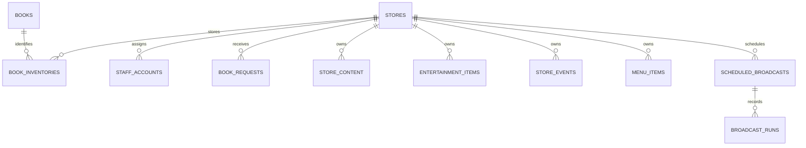

# 카툰플러스 데이터 모델

## 기준과 범위

이 문서는 운영 데이터의 기준 문서다. 실제 스키마의 단일 기준은 `supabase/migrations/`이며, 이 문서는 2026-09-14 기준 migration을 사람이 검토·운영하기 쉽게 요약한다. 문서와 migration이 다르면 migration을 우선하고 이 문서를 즉시 고친다.

데이터 모델 자체는 여러 지점을 지원한다. 그러나 현재 CSV 업로드 RPC와 공개 고객 카탈로그는 모두 `snu` 지점을 고정 조회한다. 따라서 다른 지점 데이터를 안전하게 반영·공개하려면 지점 선택을 받는 업로드·조회 구현 변경과 검증이 선행되어야 한다.

## 핵심 관계

## 테이블

| 테이블 | 목적 | 핵심 식별·제약 |
| --- | --- | --- |
| `stores` | 지점 마스터 | UUID `id`, 고유 `slug`, `name` |
| `books` | 지점과 독립적인 도서 메타데이터 | `(title, author)` 고유, 검색용 정규화·초성 컬럼, `archived_at` |
| `book_inventories` | 지점별 도서 보유 권수·서가 | `(store_id, book_id)` 고유, `volume_range`, `shelf_location`, `first_registered_at`, `archived_at` |
| `staff_accounts` | Supabase Auth 사용자와 연결된 직원 프로필 | `id`는 `auth.users(id)` FK, `login_id` 고유, 역할 `staff/admin`, 상태 `pending/approved/deactivated` |
| `book_requests` | 고객 희망 도서 신청 | `status`: `received/ordered/completed/unavailable`; 연락처는 저장하지 않음 |
| `store_content` | 지점별 공개 콘텐츠 | `(store_id, content_key)` 고유, 값은 `jsonb` |
| `entertainment_items` | 게임·보드게임 | 지점/종류/제목 고유, 실물 확인·이용 가능·보관 상태 |
| `store_events` | 지점별 이벤트 | 공개 여부, 상시 여부, 기간, 보관 상태 |
| `menu_items` | 메뉴·요금 | 지점, 카테고리, 가격, 품절·정렬 정보 |
| `broadcast_presets` | 안내 방송 문구 | 지점 전용 또는 공통(`store_id` NULL) |
| `scheduled_broadcasts` | 예약 방송 | 매일·요일·일회성, 활성화·보관 상태 |
| `broadcast_runs` | 방송 실행 감사 기록 | 예약 참조(선택), `pending/success/failure`, 오류 메시지 |

## 접근 제어

RLS가 모든 운영 테이블에서 접근 기준을 강제한다.

- 고객은 공개된 도서 카탈로그, 검증·이용 가능한 게임, 공개·기간 유효 이벤트, 메뉴 및 공개 매장 콘텐츠만 읽는다.
- 고객은 제목이 비어 있지 않은 도서 신청만 작성할 수 있다. 개인정보 연락처는 수집하지 않는다.
- `approved` 일반 직원은 `staff_accounts.store_id`와 같은 지점의 재고·신청·콘텐츠·게임·이벤트·메뉴·방송만 관리한다.
- `admin`은 전체 지점을 관리하고 직원 계정 목록, 승인·비활성화, 임시 비밀번호 발급을 추가로 수행한다.

## 지점 컨텍스트

고객과 직원 화면은 URL의 지점 `slug`를 현재 지점 컨텍스트로 사용한다. 모든 지점 종속 조회·쓰기는 이 컨텍스트의 `store_id`로 필터링한다. 임의의 브라우저 위치 추정이나 여러 지점의 콘텐츠를 한 화면에 섞는 방식은 사용하지 않는다. 상세 결정은 ADR-0005를 따른다.

## 재고 가져오기 규칙

서울대입구역점 CSV는 Caspio 형식(`title`, `number`, `genre`, `author`)을 사용한다. 잠실점 CSV는 서가 형식(`a_`, `a___`)으로, 한 `a___` 값의 `//` 묶음을 개별 제목으로 나눈다. 홍대점 CSV는 `a_`(제목 묶음), `a_1`(서가), `a_2`(장르) 형식으로 `//` 또는 권수 뒤에 오며 다음 제목이 숫자로 시작하지 않는 단일 `/` 구분자를 개별 제목으로 나눈다. 제목 자체의 `/`와 괄호 표기는 원문으로 보존한다. 모든 형식에서 끝의 공백+숫자만 권수로 분리해 `1~N권`으로 저장하고 서가 번호를 유지한다. 잠실 형식에서 숫자 뒤 괄호 표기처럼 권수와 제목을 확정할 수 없는 항목은 업로드 전에 운영자 검토 대상으로 중단한다.

가져오기는 인증된 지점 권한을 서버에서 재검증한다. 잠실·홍대 형식은 `upsert_inventory_for_store`의 명시적 대상 Store ID로만 반영하며, 일반 Staff가 다른 지점 데이터를 변경할 수 없다. 같은 지점·같은 도서는 중복 생성하지 않으며, CSV에 없는 기존 재고를 자동 삭제하지 않는다. 보관은 `archived_at`으로 처리한다.

이번 주 2개 지점 추가 작업의 목표는 **CSV 업로드 성공과 중복 검증**이다. 다만 현 구현은 `snu` 고정이므로, 다른 지점 반영은 지점 선택 구현이 검증된 뒤에만 실행한다. 고객 검색·직원 로그인·현장 표본 확인은 후속 검증 단계다.

## 변경 관리

- 스키마 변경은 새 migration으로만 추가한다. 이미 적용된 migration을 수정하지 않는다.
- 새 지점 공개 범위는 URL 지점 컨텍스트와 직원 소속 권한까지 구현·검증한 뒤에만 연다.
- 용어는 루트 `CONTEXT.md`를 따른다.
