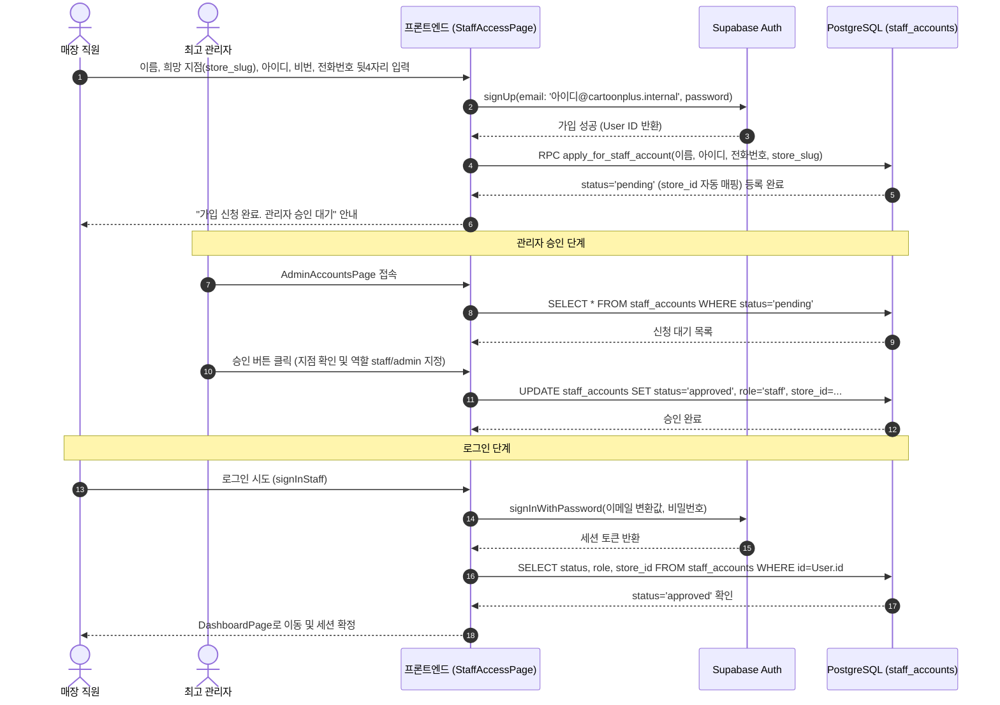
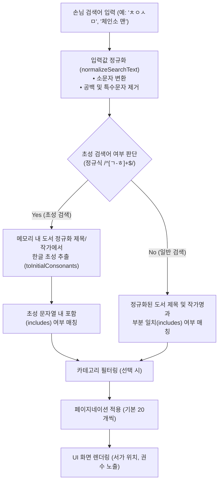
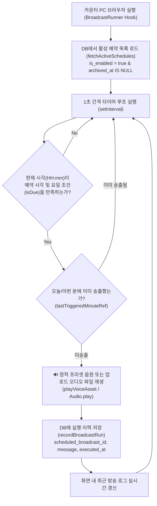
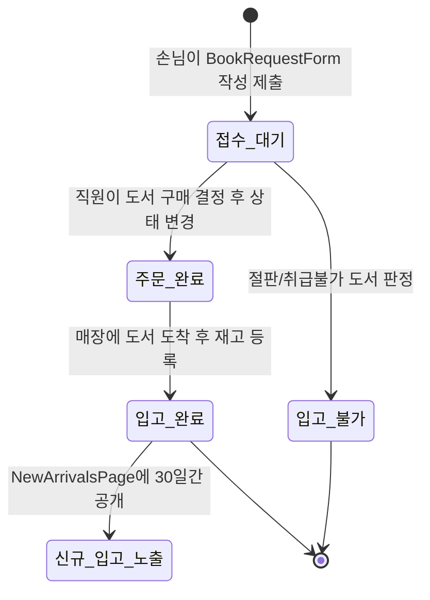

# 주요 기능 실행 흐름 및 시나리오 (Flows & Scenarios)

본 문서는 **카툰플러스(CartoonPlus)**의 핵심 기능과 비즈니스 흐름을 시퀀스 다이어그램 및 상세 단계별 설명으로 기술합니다.

---

## 1. 직원 회원가입 및 관리자 승인 플로우 (Staff Auth Flow)

매장 직원은 개인 이메일 대신 간단한 로그인 아이디(`loginId`)를 사용하며, 최고 관리자의 승인을 받아야만 매장 관리 시스템에 접근할 수 있습니다.

### 1.1. 시퀀스 다이어그램

### 1.2. 예외 처리

- 승인되지 않은 상태(`pending` 또는 `deactivated`)에서 로그인을 시도할 경우 즉시 `supabase.auth.signOut()`을 호출하여 세션을 파기하고 `"관리자 승인 후 이용할 수 있습니다."` 오류 메시지를 노출합니다.

---

## 2. 한글 초성 및 공백 정규화 검색 흐름 (Book Search Flow)

손님이 모바일이나 태블릿에서 도서명 또는 작가명을 검색할 때, 오타나 띄어쓰기 차이 및 한글 초성 입력을 유연하게 지원하는 고성능 클라이언트 검색 파이프라인입니다.

### 2.1. 검색 아키텍처 및 처리 흐름

### 2.2. 한글 유니코드 초성 분해 원리 (`bookSearch.ts`)

- 한글 음절 유니코드 공식: `초성 Index = Math.floor((Code - 0xAC00) / 588)`
- 19개 한글 초성 배열: `['ㄱ', 'ㄲ', 'ㄴ', 'ㄷ', 'ㄸ', 'ㄹ', 'ㅁ', 'ㅂ', 'ㅃ', 'ㅅ', 'ㅆ', 'ㅇ', 'ㅈ', 'ㅉ', 'ㅊ', 'ㅋ', 'ㅌ', 'ㅍ', 'ㅎ']`
- 특수문자 및 공백 제거 정규식: `replace(/[\s\p{P}\p{S}]/gu, '')`

---

## 3. 매장 자동 안내 방송 및 스케줄러 흐름 (Broadcast Flow)

카운터 PC 브라우저가 열려 있는 상태에서 지정된 시각에 맞춰 사전 녹음된 정적 고음질 음원 또는 업로드된 음성 오디오 파일(`voiceAssets`)을 매장 스피커로 자동 송출하는 무인 자동화 엔진입니다.

### 3.1. 자동 방송 실행 루프

### 3.2. 스케줄 반복 타입 (`schedule_type`)

1. **`daily` (매일 반복)**: 매일 지정된 `target_time`에 방송 송출 (예: 22:00 마감 방송).
2. **`weekly` (요일 반복)**: `target_days` 배열에 지정된 특정 요일(예: `[1, 3, 5]` = 월/수/금)의 시간에만 송출.
3. **`once` (1회성 예약)**: 지정된 특정 날짜(`target_date`)의 시간에 1회 송출 후 자동 비활성화.

---

## 4. 도서 입고 신청 ➔ 재고 처리 파이프라인 (Book Request Flow)

1. **손님 신청**: 도서명, 작가명, 요청 사유 등을 비로그인 상태로 등록.
2. **직원 검토**: `BookRequestsPage`에서 요청 목록을 확인하고, 구매 여부에 따라 상태를 변경.
3. **신규 입고 반영**: `입고 완료` 처리 및 재고(`InventoryPage`)에 추가되면 `NewArrivalsPage`에 자동으로 노출되어 다른 손님들도 신간을 확인할 수 있습니다.
