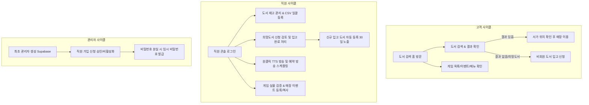

# 카툰플러스 (CartoonPlus Cafe) 제품 요구사항 정의서 (PRD)

> **문서 상태**: 기준 문서 (Single Source of Truth)  
> **기준 스펙**: 카툰플러스 서울대입구역점 운영 전환 Handoff Spec  
> **최종 갱신일**: 2026-09-17

---

## 🎯 1. 프로젝트 개요 및 배경

### 1.1 프로젝트 목적

도서 검색의 정확도를 극대화하고, 매장 엔터테인먼트 및 이벤트를 신뢰성 있게 제공하며, 직원의 반복 업무(도서 등록, 안내 방송, 입고 신청 관리)를 자동화하여 **운영비 0원($0)으로 고객 경험과 매장 운영 효율을 동시에 혁신하는 반응형 만화카페 플랫폼**을 구축한다.

### 1.2 배경 및 문제 정의 (As-Is)

- **고정 비용 발생**: 기존 아임웹 호스팅 + Caspio DB 구독으로 연 30만 원 상당의 불필요한 고정비 지출.
- **모바일/PC 레이아웃 깨짐**: 반응형 미흡으로 매장 내 모바일 접속 시 가로 스크롤 및 컨트롤 오류 발생.
- **검색 실패율 증가**: 공백 무시 및 초성 검색 미지원으로 손님이 `체인소맨` 검색 시 0건 발생 → 직원 문의 증가.
- **희망도서 누락**: 수기 메모나 구두 접수로 인해 고객 희망도서 분실 및 발주 추적 불가.
- **방송 업무 비효율**: 음료 준비, 마감, 신분증 검사 시 직원이 파파고 번역기에 매번 텍스트를 직접 입력하여 송출.
- **엔터테인먼트/이벤트 관리 부재**: 실물 검증되지 않은 게임 목록 노출 및 만료된 이벤트 방치.

### 1.3 해결 방안 (To-Be)

- **Cloudflare Pages + Supabase**: 개발·시범 운영에서 월 고정 운영비 0원($0, 도메인 실비 제외) 인프라를 유지한다.
- **공백 무시 & 초성 정규화 검색**: 도서명, 작가명, 한글 초성(`ㅊㅇㅅㅁ`) 완벽 매칭 및 도서명-권수-서가위치 분리 노출.
- **비회원 도서 입고 신청 채널**: 고객 개인정보 수집 없이 간편 신청 → 직원 접수/주문/입고완료/도서등록 원스톱 처리.
- **원클릭 & 예약 매장 안내 방송**: Web Speech API 기반 한국어 음성 매장 전용 6종 프리셋, 커스텀 방송, 매일/요일별/1회성 예약 방송 및 실행 기록(Broadcast Run) 관리.
- **검증 기반 게임 & 자동 만료 이벤트 관리**: 실물 확인된 게임만 노출(미확인 시 "점검 중" 표시), 이벤트 종료일 익일 자동 숨김.
- **안전한 직원 계정 승인 체계**: 이메일 수집 없이 이름, 로그인 ID, 비밀번호, 전화번호 뒷 4자리로 가입 신청 → 관리자 승인제.

---

## 👥 2. 사용자 및 서비스 사이클

### 2.1 사용자 역할 정의

1. **고객 (Guest / 비회원)**
   - 별도 회원가입/로그인 없이 모든 공개 서비스(도서 검색 홈, 매장 소개, 게임 카탈로그, 이벤트, 메뉴/요금제, 도서 입고 신청) 이용.
2. **매장 직원 (Staff)**
   - 관리자 승인 완료 계정으로 로그인하여 도서 재고 관리, CSV 일괄 가져오기, 입고 신청 처리, 게임 검증, 이벤트 관리, 방송 송출 및 예약 관리 수행.
3. **점주 / 시스템 관리자 (Admin)**
   - Staff의 모든 권한을 포함하며, 직원 가입 승인/반려, 계정 비활성화, 임시 비밀번호 발급 등 계정 관리 총괄.

### 2.2 사용자 시나리오 사이클

---

## 🚀 3. 런칭 범위 및 단계별 로드맵

### 1단계 (MVP / 서울대입구역점 시범 운영) - _현재 범위_

- **시범 지점**: 서울대입구역점. 데이터 모델은 다지점을 지원하지만, URL 기반 지점 선택·지점 범위 권한이 구현되기 전에는 다른 지점을 공개·업로드하지 않는다.
- **고객 포털**:
  - 도서 검색 중심 홈: PC·모바일 모두 루트에서 검색창과 도서 목록 제공. 기존 브랜드 콘텐츠는 별도 매장 소개 메뉴로 유지
  - 도서 검색 화면 (공백 무시, 초성 검색, 텍스트 전용 카드, 30일 신간 배지)
  - 도서 입고 신청 폼 (개인정보 미수집, 비회원 간편 신청)
  - 엔터테인먼트 카탈로그 (검증된 게임만 노출, 미검증 시 점검 중 표시)
  - 매장 이벤트 (진행 중 이벤트 노출, 종료일 익일 자동 숨김)
  - F&B 메뉴판 및 선/후불 이용 요금제 안내 (현장 결제 안내)
  - 매장 안내 (영업시간, 주소, 전화번호, 주차 가이드)
- **직원/관리자 콘솔**:
  - 로그인 후 처리 대기 도서 입고 신청, 당일 예약 방송, 최근 재고 작업을 제공하는 운영 대시보드
  - 직원 계정 신청/승인/비활성화/임시 비밀번호 발급
  - 도서 재고 단건 등록/수정, 삭제(복구 미지원)
  - Caspio CSV 일괄 가져오기 (도서명+작가명 기준 업데이트, 안전 보존)
  - 입고 신청 접수 → 주문완료 → 입고완료 → 재고 등록 연계
  - 매장 안내 방송 매장 전용 6종 프리셋, 커스텀 즉시 방송, 예약 방송 스케줄러, 방송 실행 기록(Broadcast Run) 및 실패 재시도
  - 게임 실물 검증 및 이벤트 등록/복사 기능
- **인프라**: Cloudflare Pages + Supabase Free Plan ($0 고정비, 도메인 실비 제외)

### 2단계 (시각화 및 외부 연동 고도화)

- 매장 평면도(Floor Map) 기반 서가 위치 핀포인트 시각화
- 카카오 지도 / 네이버 지도 길찾기 API 연동
- 잠실점·홍대점 멀티 지점 활성화 및 지점 전환 UI 개방

### 2단계 공개 운영 지점 적용 기준

- **대상 지점**: 서울대입구역점(`snu`), 잠실점(`jamsil`), 홍대점(`hongdae`)을 `/stores/:slug`로 공개한다. 기존 루트와 단축 주소는 서울대입구역점으로 호환한다.
- **도서 재고**: `docs/assets/jamsilbook_2026-Sep-14_0934.csv`와 `docs/assets/hongdaebook_2026-Sep-14_0936.csv`를 각 지점에만 가져온다. 잠실 CSV의 `//` 묶음 행은 개별 도서 재고로 분리하고, 원본 행의 서가 번호를 유지한다.
- **잠실점 확인 콘텐츠**: 현장 사진에서 확인한 닌텐도·플레이스테이션 게임, 요금제·메뉴와 아구·콘서트 티켓 인증 시 4,000원 음료 증정 상시 이벤트를 공개한다. 복지카드 제휴 안내는 구체적인 혜택 조건을 확인하기 전까지 공개 이벤트로 만들지 않는다.
- **미확인 콘텐츠**: 지점별 메뉴·요금·게임·이벤트·매장 안내 가운데 확인 근거가 없는 항목은 추정해 복제하지 않고 숨기거나 `점검 중`으로 표시한다.
- **운영 권한**: 일반 직원은 자신의 `Store`만, 관리자는 모든 공개 운영 지점을 관리한다. RLS·RPC는 화면 상태와 무관하게 타 지점 쓰기를 거부한다.

### 3단계 (매장 운영 자동화)

- 직원 디지털 출석 체크 (근태 관리)
- 파트별 일일 업무 체크리스트 & 오퍼레이션 매뉴얼
- 룸/좌석 실시간 이용 현황 연동

---

## 📱 4. UI/UX 디자인 시스템 가이드

- **컬러 팔레트**: 카툰플러스 옐로우(`Brand Yellow: #FED943`), 딥 차콜(`Deep Charcoal: #1E1E1E`), 서브 웜그레이.
- **컴포넌트 룩앤필**: 부드러운 라운디드 카드(`rounded-2xl`), 시각적 위계가 명확한 텍스트 카드.
- **아이콘 시스템**: 일관된 선형(Linear) SVG 아이콘 시스템 사용. _이모지 남발, 3D 스티커, AI 생성 장식 아이콘 엄격 배제_.
- **에셋 활용**: 공식 승인된 마스코트 에셋(10종) 및 매장 실사 사진(Store Photos) 정품 에셋만 활용.
- **모바일 반응형**: 모바일 화면에서 가로 스크롤/잘림 없는 하단 Sticky 바 및 탭 네비게이션 적용.
- **화면 구조**: 고객 기본 탐색은 도서 검색(홈), 매장 소개, 즐길거리, 메뉴·요금, 이벤트·공지, 매장 안내로 구성한다. 루트 첫 화면에 검색창과 도서 목록을 제공하고, 로고의 일반 클릭은 도서 검색 홈으로 연결한다.
- **직원 콘솔**: 로그인 후 처리 대기 도서 입고 신청, 당일 예약 방송, 최근 재고 작업을 보여 주는 대시보드를 제공한다. 재고·게임·이벤트·예약 방송 등 전체 운영 항목은 삭제 후 서비스 내 복구를 지원하지 않는다.
- **접근성**: 장식 애니메이션은 필요한 피드백으로 제한하며 `prefers-reduced-motion`을 지원한다.

2026-09-14 1차 중간 피드백의 상세 동작과 검수 기준은 `docs/REQUIREMENTS.md` FR-STORE-001, FR-STORE-006, FR-AUTH-003, FR-AUTH-007 및 공통 UI 절을 따른다. 이번 모바일 개선은 고객 화면 전체를 우선 대상으로 하며, 직원 콘솔 전체 재설계는 후속 범위로 둔다. 이번에 변경하는 직원 진입·로그인·로그아웃은 PC와 모바일에서 검수한다.

### 4.1 고객·직원 UI 재설계 기준

- **참조 디자인**: `docs/wireframes`의 카툰플러스 반응형 목업을 시각 기준으로 사용한다. 옐로우·차콜·크림 색상, 두꺼운 테두리, 둥근 카드와 칩, 공식 마스코트 및 확인된 매장 사진의 분위기를 고객·직원 화면에 일관되게 적용한다.
- **고객 정보 구조**: 도서 검색(홈), 매장 소개, 즐길거리, 메뉴·요금, 이벤트·공지, 매장 안내를 기본 탐색으로 제공한다. 신규 입고는 도서 검색 홈과 검색 필터로, 도서 입고 신청은 검색 결과 없음 및 도서 검색 보조 행동에서 제공한다.
- **직원 정보 구조**: 대시보드, 도서·입고, 매장 콘텐츠, 방송을 업무 단위로 묶고, 직원 계정 관리는 관리자에게만 노출한다. 재고·게임·이벤트·예약 방송 등 전체 운영 항목의 보관·복구 기능을 제거한다.
- **반응형 원칙**: 모바일은 터치와 좁은 폭에 맞춰 탐색·표·폼·주요 행동을 재배치하는 완결된 화면으로 제공한다. PC는 다열 정보와 지속 표시 운영 탐색을 사용한다. 두 환경 모두 가로 스크롤 없이 주요 고객·직원 업무를 완료할 수 있어야 한다.
- **공개 정보 원칙**: 가격, 보유 수, 시설, 예약 가능 여부 등의 고객 공개 정보는 확인된 운영 데이터만 사용한다. 별도 공지 엔터티·공지 관리 기능은 만들지 않고 고정 안내는 이벤트 화면에 둔다.

### 4.2 UI 재설계 완료 기준

1. 고객과 직원·관리자 화면 전체가 공통 디자인 시스템과 역할별 탐색을 사용한다.
2. 모바일, 태블릿, PC에서 고객 탐색·도서 검색·도서 입고 신청과 직원 로그인·재고·입고 신청·방송의 주요 흐름을 완료할 수 있다.
3. 로딩, 빈 결과, 성공, 오류, 권한 없음 상태를 화면별로 일관되게 제공한다.
4. `/search`, `/entertainment`, `/event`는 각각 기준 경로인 `/books`, `/games`, `/events`로 이동한다.
5. 자동화 테스트, 타입 검사, 프로덕션 빌드를 통과하고 모바일·PC 수동 검증을 완료한다.

### 4.3 UI 재설계 제외 범위

- 잠실점 선택 및 다지점 운영 화면
- XLSX 파일 가져오기
- 별도 공지 작성·게시·만료 관리
- 확인되지 않은 가격, 게임 수, 시설, 룸 예약, 인기 지표의 고객 노출

---

## 📚 5. 상세 기능 명세 (Functional Specifications)

### 5.1 도서 검색 엔진 (Book Search)

- **공백 무시(Whitespace Normalization)**: 검색어와 도서명의 공백 및 특수문자를 제거하여 부분 일치 비교 (`체인소 맨` = `체인소맨`).
- **한글 초성 검색(Initial Consonant Search)**: 검색어가 한글 자음(초성)으로만 구성된 경우 초성 인덱스와 비교 (`ㅊㅇㅅㅁ` → `체인소 맨`).
- **무효 쿼리 방어**: 공백 제거 후 빈 문자열이거나 특수문자만 있는 경우 전체 도서가 매칭되지 않도록 차단 (0건 반환).
- **텍스트 전용 카드(Text-Only)**: 도서 표지 이미지 로딩 없이 `[도서명]`, `[작가명]`, `[장르 배지]`, `[보유 권수(예: 1~16권)]`, `[📍 서가 위치(예: A-05 서가)]` 노출.
- **신규 입고 도서(New Arrival)**: 재고 최초 등록일로부터 30일간 `[NEW]` 배지 노출 및 신간 탭 자동 노출. 30일 경과 시 자동 제외.
- **검색 결과 없음**: 도서 입고 신청 모달로 즉시 연결하는 직관적 CTA 제공.

### 5.2 도서 입고 신청 (Book Request)

- **고객 신청 폼**: `[도서명(필수)]`, `[작가/출판사(선택)]`, `[희망 권수(선택)]`, `[손님 한마디(선택)]`. _연락처/개인정보 일체 미수집_.
- **직원 처리 라이프사이클**:
  - `접수(PENDING)`: 손님 신청 등록 초기 상태
  - `주문 완료(ORDERED)`: 매장 발주 진행 중
  - `입고 완료(COMPLETED)`: 매장 도착 → 신규 도서 등록 모달로 데이터 자동 전달
  - `입고 불가(REJECTED)`: 절판/미출간 등으로 취소 시 관리자 사유 메모 기재

### 5.3 도서 재고 관리 & CSV Import (Inventory)

- **재고 등록/수정**: 도서명, 작가, 장르, 보유 권수, 서가 위치, 관리자 메모 입력.
- **CSV 안전 가져오기(Safe Import)**:
  - 매칭 룰: `도서명 + 작가명` 복합 기준
  - 매칭 레코드: 보유 권수 및 서가 위치 갱신
  - 신규 레코드: 신규 도서 및 재고 추가
  - 기존 전용 레코드: 자동 삭제되지 않고 안전 보존(Staff 검토 대상 표기)
- **삭제(복구 미지원)**: 전체 운영 항목에서 보관함·복원 기능을 제거한다. 기존 보관 데이터는 대상·건수 확인 후 영구 삭제하며 사용 중인 항목은 유지한다. 도서 삭제는 해당 지점 재고만 대상으로 하고 공통 도서 정보와 다른 지점 재고는 유지한다.

### 5.4 매장 안내 방송 (Broadcast)

- **음성 전환 방향 (2026-09-17 확정, 구현 예정)**: 추가 운영비 0원으로 기존 고정 MP3를 제거한다. 먼저 매장 PC에서 무료 음성을 비교하고 속도·문장별 쉬는 간격을 조정해 실제 안내 문구로 품질을 검증한다. 최종 엔진은 청취 검증 후 결정하며, 새 음성 파일 저장·재사용은 허용한다.
- **프리셋 관리**: 승인된 직원이 제목·문구를 편집하고 추가·삭제·미리듣기한다. 문구 변경은 연결된 예약에 반영하며 저장 전에 영향받는 예약을 표시한다. 상세 기준은 [요구사항 명세서](REQUIREMENTS.md)의 FR-BCAST-001/003을 따른다.
- **초기 매장 안내방송 프리셋 (6종, 이후 편집 가능)**:
  1. ☕ `[음료 픽업 요청]` (수동): 주문 음료 카운터 픽업 및 카카오톡 알림 확인 안내
  2. 🕒 `[기본 정돈 안내]` (매일 14:00 예약/수동): 퇴실 시 담요/만화책/식기 반납 및 쓰레기 분리배출 안내
  3. 🚫 `[만석 자리이동 제한]` (수동): 만석으로 인한 자리 이동 제한 및 이용 후 정돈 안내
  4. 🤫 `[소음 주의 안내]` (수동): 쾌적한 이용을 위한 소음 삼가 및 자리 정돈 안내
  5. 🪪 `[신분증 검사]` (매일 21:45 예약/수동): 밤 10시 미성년자 신분증 확인 준비 및 퇴실 정돈 안내
  6. 🌙 `[마감 안내]` (매일 22:45 예약/수동): 23시 영업 종료 안내, 22시 50분 마감 준비 및 반납 정돈 안내
- **커스텀 즉시 방송**: 직원이 직접 입력한 임의 텍스트 즉시 합성 및 송출.
- **예약 방송(Scheduled Broadcast)**:
  - 스케줄 타입: 매일(daily), 특정 요일(weekdays), 1회성(one-time)
  - ON/OFF 활성화 스위치와 문구·시간·요일·날짜 수정 및 삭제
  - 기존 예약은 유지하며 삭제한 기본 예약은 자동 재생성하지 않는다. 삭제 후에도 과거 방송 실행 기록은 유지한다.
  - 지점마다 카운터 PC의 방송 담당 탭 하나에서 수동·예약 방송을 순서대로 재생한다. 다른 기기는 관리 및 연결 상태 확인을 지원한다.
  - 현재 방송 중지·대기 방송 취소를 제공하며 실패 방송은 수동 재시도한다.
  - PC 종료 등으로 놓친 예약은 미실행으로 표시하고 나중에 자동 송출하지 않는다.
  - 프리셋 삭제 시 연결 예약을 보여주고 함께 삭제한다.
- **방송 실행 기록(Broadcast Run)**:
  - 상태: 대기·재생 중·성공·실패·취소·미실행을 구분한다. 예약·프리셋을 삭제해도 당시 문구·실행 시각·결과를 유지한다.
  - 오디오 오류 등으로 실패 시 콘솔에서 [즉시 재시도(Replay)] 제공.

### 5.5 엔터테인먼트 & 매장 이벤트

- **게임 카탈로그**:
  - 직원이 실물 검증(`is_verified = TRUE`)한 타이틀만 고객 화면 노출.
  - 미검증 상태일 경우 "점검 중(Pending Game Catalog)" 안내 뷰 노출.
- **매장 이벤트**:
  - 이벤트 제목, 시작일, 종료일, 내용, 이미지 등록.
  - 종료일 익일 자정부터 고객 화면에서 자동 숨김.
  - 과거 이벤트 복사(Draft 생성) 기능 지원.

### 5.6 직원 계정 및 관리자 인증 (Auth)

- **직원 진입·로그인 유지**: 공개 로그인 버튼을 제거하고 로고 2초 길게 누르기로 진입한다. 매장 전용 PC와 직원 개인 기기에서 유효한 세션을 복원하고 명시적 로그아웃을 제공한다. 상세 기준은 `docs/REQUIREMENTS.md` FR-AUTH-003, FR-AUTH-007을 따른다.
- **가입 절차**: 이름, 로그인 ID, 비밀번호, 휴대폰 번호 뒷 4자리 입력 후 가입 신청. (이메일 불필요)
- **계정 상태**: `대기(pending)` → `승인(approved)` / `비활성화(deactivated)`.
- **최초 관리자**: Supabase 콘솔에서 초기 관리자(Admin) 계정 1회 수동 생성.
- **임시 비밀번호**: 비밀번호 분실 시 관리자가 임시 비밀번호를 발급하여 전달.

---

## 💰 6. 인프라 및 $0 운영비 타당성 검증

| 항목                               | 무료 제공 한도                   | 카툰플러스 예상치                                         | 판정                                      |
| :--------------------------------- | :------------------------------- | :-------------------------------------------------------- | :---------------------------------------- |
| **DB 용량 (Supabase)**             | **500 MB**                       | 약 33 MB (3개 지점 합산 도서 4만~5만 권의 단순 비례 추정) | **여유, 실제 반영 후 측정**               |
| **API 트래픽 (Supabase)**          | **5 GB / 월**                    | 약 1.5 GB / 월 (월 100만 회 조회)                         | **초여유**                                |
| **정적 호스팅 (Cloudflare Pages)** | 정적 자산 요청·전송 무료         | 현재 정적 React 배포                                      | **Free 유지**                             |
| **TTS 음성 API**                   | **무제한 무료** (Web Speech API) | 1일 50~100회 송출                                         | **추가 비용 $0**                          |
| **총 고정 운영비**                 | -                                | 개발·시범 운영                                            | **월 0원 ($0 / month), 도메인 실비 제외** |

---

## 📊 7. 성공 지표 (KPI)

1. **검색 실패율**: 공백/초성 미지원으로 인한 0건 검색 비율 기존 대비 95% 이상 감소.
2. **카운터 도서 위치 문의**: 손님의 직접 서가 탐색으로 직원 대면 문의 70% 감소.
3. **희망도서 처리율**: 접수된 희망도서의 100% 전산화 및 주문/입고 추적.
4. **방송 송출 편의성**: 번역기 타이핑(1분) → 원클릭(1초) 단축.
5. **고정비 절감**: 아임웹/Caspio 구독 해지로 연 30만 원 상당 고정비 100% 절감.
