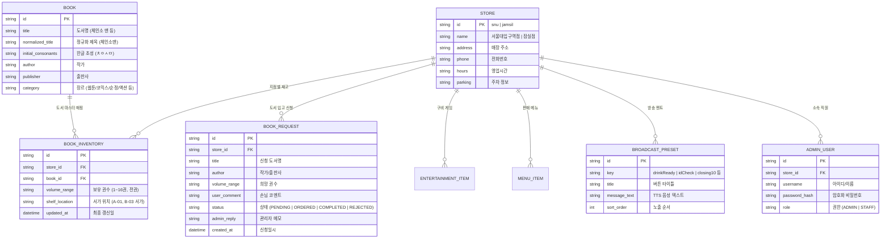

<aside>
📌

**카툰플러스 (CartoonPlus Cafe) 서비스 기획 문서**

목적, 타깃, 핵심 가치, 기술 전략, 로드맵, 성공 지표까지 한눈에 정리합니다.

</aside>

## 🎯 기획 정리

### 1. 프로젝트 서비스의 주 목적

도서 검색의 정확도를 극대화하고, 매장 엔터테인먼트 정보를 제공하며, 매장 직원의 반복 업무(도서 등록, 안내 방송)를 자동화하여 **운영비 0원($0)으로 고객 경험과 매장 운영 효율을 동시에 혁신하는 반응형 만화카페 플랫폼**이다.

- 기존 아임웹+Caspio 유료 구독 구조를 탈피하여 **도입비 및 월 고정 운영비 0원 인프라**를 구축한다.
- 띄어쓰기 무관 공백 무시 검색과 권수 분리 구조로 손님이 직원을 찾지 않고도 **도서와 서가 위치(`A-03`)를 3초 안에 스스로 탐색**한다.
- 매장 포스/PC에서 버튼 하나로 **한국어 음성(TTS)**을 스피커로 송출해 번역기 수동 입력 방송을 완전 대체한다.

### 2. 사용자가 경험할 한 사이클

### 2. 사용자가 경험할 한 사이클

#### [고객 사이클: 탐색부터 매장 이용까지]
1. **지점 선택 & 홈 방문** — 서울대입구역점 / 잠실점 중 방문 지점을 선택하고 마스코트 힐링 브랜드 콘텐츠를 확인한다.
2. **도서 & 엔터테인먼트 탐색** — 띄어쓰기 신경 쓰지 않고 만화/웹툰을 검색하여 보유 권수와 서가 위치를 확인하거나, 닌텐도/Xbox/보드게임 및 F&B 메뉴를 둘러본다.
3. **도서 입고 신청 (원하는 도서가 없을 때)** — 매장에 없는 희망 도서가 있다면 비로그인 상태로 간편하게 입고 신청을 접수한다.
4. **매장 방문 & 쾌적한 이용** — 매장에 비치된 서가 위치 텍스트를 보고 도서를 바로 찾아 룸에서 편안하게 즐긴다.

#### [직원 사이클: 재고 관리부터 매장 방송까지]
1. **직원 콘솔 로그인** — 매장 포스/PC에서 이름과 비밀번호로 간편하게 접속한다.
2. **도서 재고 등록/수정 & 엑셀 업로드** — 신간 입고 시 개별 모달 등록 또는 엑셀 일괄 업로드로 수백 권의 도서를 단 몇 초 만에 갱신한다.
3. **도서 입고 신청 검토 및 처리** — 손님들이 신청한 희망도서 목록을 확인하고, 발주 상태 변경(`주문완료`/`입고완료`) 및 신규 도서 등록으로 바로 연계한다.
4. **원클릭 매장 방송 송출** — 음료 완성, 심야 신분증 검사, 마감 시간 도래 시 프리셋 버튼을 클릭하여 즉시 스피커로 안내 멘트를 자동 방송한다.

### 3. 사이클에 해당하는 MVP 기능 (1단계)

- **지점 관리**: 서울대입구역점, 잠실점 멀티 지점 선택 및 지점별 데이터 자동 연동
- **도서 검색**: 공백 무시(Whitespace-Agnostic) 검색, 초성 검색, 장르 필터, 텍스트 전용 상세 카드 (권수 분리 + 서가 위치 뱃지)
- **도서 입고 신청**: 손님 희망도서 간편 신청 폼 & 직원 신청 접수/검토 관리 (상태 변경 및 도서 등록 연동)
- **엔터테인먼트 & 메뉴**: 닌텐도 스위치 / Xbox / 보드게임 카탈로그, F&B 메뉴판, 선/후불 요금제 안내
- **매장 안내**: 지점별 위치, 영업시간, 전화번호, 주차, 1차 시설 안내
- **직원/관리자 콘솔**: 직원 간편 로그인(이름/비밀번호), 도서 재고 빠른 수정 & 엑셀 일괄 등록, 입고 신청 관리, 원클릭 매장 안내 방송 시스템 (Web Speech TTS)

### 4. 추후 확장 기능 (2단계 & 3단계)

- **2단계 (시각화 & 지도)**: 매장 평면도(Floor Map) 내 서가 위치 핀포인트 시각화, 카카오 지도 / 네이버 지도 API 연동, 신간 자동 입고 알림
- **3단계 (매장 운영 자동화)**: 직원 출석 체크 (근태 관리 시스템), 파트별 업무 가이드 & 일일 체크리스트, 매장 룸/좌석 실시간 이용 현황 연동

---

# CartoonPlus Cafe

### 만화부터 넷플릭스·닌텐도까지, 쉬는 게 제일 즐거워지는 곳

도심 속 가장 아늑한 복합 문화 힐링 라운지, 카툰플러스의 스마트 도서 검색 및 매장 운영 자동화 솔루션

---

# 1. 프로젝트 개요

## 프로젝트 소개

**카툰플러스 (CartoonPlus Cafe)**는 서울대입구역점, 잠실점 등 대형 만화카페를 이용하는 고객에게는 빠르고 정확한 **도서/엔터테인먼트/메뉴 검색 편의 및 희망도서 입고 신청**을 제공하고, 매장 직원에게는 **도서 재고 관리, 입고 신청 처리 및 원클릭 매장 안내 방송 자동화 환경**을 제공하는 올인원 웹 플랫폼이다.

기존 아임웹 템플릿과 외부 노코드 DB(Caspio) 임베드 방식은 매월 유료 구독료가 발생하고, 모바일 화면 깨짐, 띄어쓰기 검색 불가, 수동 데이터 입력, 파파고 수동 방송 등의 비효율을 초래했다.

카툰플러스 신규 플랫폼은 **GitHub Pages + Supabase의 엔터프라이즈급 무료 티어를 활용하여 운영비 0원($0)**을 실현하며, 데이터베이스 정규화와 웹 TTS 기술을 통해 고객과 직원의 편의성을 극대화한다.

---

# 2. 문제 정의 (As-Is)

기존 사이트 및 매장 운영 과정에서 다음과 같은 문제가 반복적으로 발생했다.

- **매달 지출되는 고정 비용**: 아임웹 호스팅비 및 Caspio DB 유료 플랜으로 인한 불필요한 요금 낭비 발생 (순수 도메인 유지비 외 모든 고정비 제거 필요).
- **도서명과 권수 병합 저장**: 테이블 컬럼에 `원피스 1~108권` 형태로 저장되어 권수별 재고 관리 및 검색 필터링이 불가능함.
- **띄어쓰기 검색 실패**: 공백 무시 검색이 지원되지 않아 손님이 `체인소맨`으로 검색하면 검색 결과가 0건으로 나와 직원에게 직접 물어봄.
- **희망도서 신청 채널 부재**: 손님이 찾는 책이 없을 때 직원에게 구두로만 말하거나 메모지에 적어두어 분실/누락 발생.
- **불편한 데이터 입력 방식**: 신간 입고 시 직원이 외부 DB 사이트에 직접 접속해 한 건씩 수동 입력해야 하므로 업무 피로도 증가.
- **비효율적인 매장 방송**: 음료 픽업, 마감 안내, 신분증 검사 시 직원이 매번 파파고 번역기에 문장을 타이핑하여 스피커로 재생함.
- **모바일 UX 저하 및 브랜드 전달 부족**: 모바일과 데스크톱 레이아웃이 상이하고, 넷플릭스/닌텐도/안마의자 등 매장의 핵심 매력이 전달되지 않음.

---

# 3. 해결 방안 (To-Be)

카툰플러스는 정규화된 데이터 모델과 현대적인 웹 기술을 통해 매장 운영 전반의 비효율을 해결한다.

### 핵심 해결책

- **공백 무시 정규화 검색 엔진**: `체인소 맨`과 `체인소맨`, `귀멸의칼날`을 동일 매칭하여 검색 실패율 0% 달성.
- **도서명-권수-서가위치 분리 모델링**: 권수 범위와 서가 텍스트(`A-03 서가`)를 명확히 분리하여 텍스트 카드로 직관적 노출.
- **도서 입고 신청 (희망도서 접수)**: 비회원 손님도 웹에서 간편하게 입고를 신청하고 직원이 콘솔에서 검토 및 발주/입고 완료 처리.
- **원클릭 한국어 TTS 방송 콘솔**: 원클릭 프리셋 버튼으로 한국어 음성을 즉시 스피커로 송출.
- **엑셀 일괄 등록 (Bulk Upload)**: 대량의 도서 목록을 파일 업로드 한 번으로 즉시 동기화.
- **마스코트 캐릭터 & 옐로우 브랜드 아이덴티티**: 귀여운 강아지 마스코트와 트레이드 옐로우(#FED943) 컬러로 밝고 따뜻한 힐링 분위기 조성.
- **비용 0원 클라우드 아키텍처**: GitHub Pages + Supabase Free Plan으로 고정비 완전 무료화.

---

# 4. 핵심 차별점

## 1) 공백 무시 스마트 도서 검색

기존 시스템은 단순 일치 검색만 지원하여 공백 하나로 검색이 실패했다.

```
손님 검색: "체인소맨" (띄어쓰기 없음)
    ↓
기존 시스템 DB: "체인소 맨 1~16권"
    ↓
검색 실패 (0건) → 직원 문의 발생
```

카툰플러스는 공백/특수문자를 제거한 정규화 인덱싱(Whitespace Normalization) 및 초성 매칭을 지원한다.

```
손님 검색: "체인소맨" / "체인소 맨" / "ㅊㅇㅅㅁ"
    ↓
정규화 처리: "체인소맨"
    ↓
실시간 정확 매칭 → [보유: 1~16권] [📍 A-05 서가 (인기신간 존)] 노출
```

## 2) 원클릭 매장 안내 방송 (TTS 음성 송출)

직원이 번역기에 문장을 입력하고 복사하던 수동 작업을 웹 콘솔 원클릭으로 자동화했다.

```
[원클릭 버튼 클릭] (예: 🌙 마감 10분 전)
    ↓
Web Speech API 한국어 TTS 자동 음성 송출
    ↓
매장 스피커로 안내 방송 즉시 송출 완료
```

## 3) 텍스트 전용 경량화 도서 카드 (Text-Only)

불필요한 이미지 로딩 대기 시간과 스토리지 비용을 없애고, 도서 탐색의 본질(제목, 작가, 권수, 서가 번호)에 집중한 깔끔한 UI를 제공한다.

---

# 5. 서비스 플로우

## STEP 1. 고객 탐색 플로우 (Client Flow)

```
[지점 선택] (서울대입구역점 / 잠실점)
    ↓
[메인 홈] 카툰플러스 소개 & 4대 힐링 포인트 (만화/넷플릭스/닌텐도/안마의자)
    ↓
[도서 검색] 공백무시 키워드 입력 & 장르 필터
    ├── [결과 확인] 보유 권수 & 서가 위치 배지 (📍 A-03 서가) 확인
    └── [결과 없음 / 희망 도서] → [도서 입고 신청] (제목, 작가, 권수, 코멘트 입력)
    ↓
[추가 탐색] 닌텐도/Xbox/보드게임 목록 & F&B 메뉴/요금제 확인
```

---

## STEP 2. 직원 관리 플로우 (Admin Flow)

```
[직원 콘솔 로그인] (이름 + 비밀번호)
    ↓
[관리자 통합 대시보드]
  ├── 📚 [도서 재고 관리]
  │     ├── 개별 도서 빠른 수정 (서가 번호/권수 즉시 갱신)
  │     ├── 신규 도서 등록 모달
  │     └── 엑셀(CSV/XLSX) 대량 도서 일괄 업로드
  ├── 📥 [도서 입고 신청 관리]
  │     ├── 지점별 손님 희망도서 신청 목록 검토
  │     ├── 상태 변경 (PENDING → ORDERED → COMPLETED / REJECTED)
  │     └── 입고 완료 시 신규 도서 등록 모달 자동 연동
  └── 📢 [매장 안내 방송 콘솔]
        ├── ☕ [음료 제작 완료] / 🪪 [밤 10시 신분증 검사]
        ├── 🌙 [마감 30분 전] / ⏰ [마감 10분 전]
        ├── 🚫 [외부음식 제한] / 🤫 [정숙/소음 주의]
        └── 📢 [커스텀 텍스트 직접 입력 방송]
```

---

# 6. 도메인 및 데이터 구조 설계

## 데이터베이스 엔티티 (ERD)



---

# 7. 주요 기능 명세

## 1. 메인 홈 (Home)

- **헤더**: 마스코트 로고, 지점 퀵 셀렉터, GNB 메뉴, 직원 콘솔 링크
- **히어로 배너**: 마스코트 힐링 비주얼, 브랜드 슬로건, 퀵 검색바, 인기 검색어 해시태그
- **4대 힐링 포인트**: 📚 3만 권 도서 & 웹툰, 🎬 넷플릭스 프라이빗 룸, 🎮 닌텐도/Xbox 게임룸, 🛋️ 프리미엄 안마의자 룸
- **신간 프리뷰**: 지점별 이번 주 신간 도서 텍스트 카드
- **매장 퀵 정보**: 서울대입구역점 & 잠실점 위치, 영업시간, 전화번호, 주차 안내

## 2. 스마트 도서 검색 (Book Search)

- **지점 선택 필터**: 현재 지점 실시간 전환 및 지점별 보유 권수/서가 반영
- **공백 무시 검색**: 공백/특수문자 제거 정규화 매칭 및 초성 검색
- **장르 필터**: [전체] [웹툰] [코믹스/소년] [순정/로맨스] [액션/판타지] [소설/라노벨]
- **텍스트 전용 결과 카드**: 제목, 작가, 출판사, 장르 배지, 보유 권수, 노란색 서가 위치 뱃지(`[📍 A-03 서가]`)
- **도서 입고 신청 연결**: 검색 결과가 없거나 원하는 도서가 없을 때 희망도서 신청 모달 연결

## 3. 도서 입고 신청 (Book Request)

- **손님 신청 폼 (비회원)**: 희망 지점, 신청 도서명(필수), 작가/출판사, 희망 권수, 손님 코멘트 간편 접수
- **관리자 검토 및 상태 처리**: 지점별 접수 목록 조회, 상태 변경(`PENDING` $\rightarrow$ `ORDERED` $\rightarrow$ `COMPLETED` / `REJECTED`), 관리자 메모 작성
- **도서 등록 자동 연동**: `COMPLETED(입고완료)` 처리 시 도서 재고 등록 모달로 데이터 자동 전달

## 4. 엔터테인먼트 카탈로그 (Entertainment)

- **닌텐도 스위치**: 구비 팩 목록 (마리오카트, 대난투, 저스트댄스 등), 지원 인원(1~4인), 장르
- **Xbox Series X**: 최신 타이틀 (포르자 호라이즌, 헤일로 등)
- **보드게임**: 인기 보드게임 (루미큐브, 스플렌더, 카탄 등), 추천 인원, 난이도

## 5. 메뉴 & 요금제 (Menu & Pricing)

- **이용 요금제**: 1시간 기본, 2시간+음료, 3시간+음료, 온종일 자유이용권 (선/후불 결제 안내)
- **F&B 메뉴판**: 식사/라면, 스낵/디저트, 음료/커피, 세트메뉴 가격 및 BEST 배지

## 6. 직원 관리자 콘솔 (Staff Desk)

- **직원 간편 로그인**: 이름/아이디 + 비밀번호로 매장별 로그인
- **원클릭 매장 방송 (TTS)**: 음료 제작 완료, 밤 10시 신분증 검사, 마감 30분/10분 전, 외부음식 제한, 정숙 안내 + 커스텀 텍스트 직접 입력 방송
- **도서 재고 관리**: 도서 신규 등록 모달, 서가 위치/권수 인라인 빠른 수정, 엑셀 일괄 업로드
- **입고 신청 관리**: 손님 희망도서 신청 목록 검토 및 처리

---

# 8. 기술 구현 전략 & 아키텍처

## 기술 스택

### Frontend

- **React / Next.js** (또는 Vanilla SPA)
- **TypeScript**
- **Tailwind CSS** (시그니처 옐로우 #FED943, 딥 차콜 #1E1E1E)
- **Phosphor Icons**

### Audio & AI Voice

- **Web Speech API (`SpeechSynthesis`)**: 브라우저 내장 고품질 한국어 TTS 엔진 (외부 유료 TTS API 호출 비용 $0)

### Backend & Database

- **Supabase (PostgreSQL)**:
  - 도서 마스터, 지점별 재고, 입고 신청, 방송 프리셋 데이터 관리
  - Row Level Security (RLS) 및 Admin Auth

### Hosting & Infrastructure

- **GitHub Pages / Vercel**: 글로벌 CDN 기반 정적 웹 호스팅 (월 대역폭 100GB 무료)

---

## 💰 비용 0원 ($0) 타당성 객관적 검증

| 항목              | 무료 제공 한도                   | 카툰플러스 예상 사용량          | 여유율 및 판정                     |
| :---------------- | :------------------------------- | :------------------------------ | :--------------------------------- |
| **도서 DB 용량**  | **500 MB** (Supabase)            | **약 15 ~ 25 MB** (도서 3만 권) | **초여유 (용량의 4% 사용)**        |
| **API 트래픽**    | **5 GB / 월** (Supabase)         | **약 1 ~ 2 GB / 월**            | **초여유 (월 150만 회 검색 가능)** |
| **웹 트래픽**     | **100 GB / 월** (GitHub Pages)   | **약 5 ~ 10 GB / 월**           | **초여유 (방문자 수만 명 수용)**   |
| **TTS 음성 비용** | **무제한 무료** (Web Speech API) | 매장 매일 50~100회 송출         | **추가 API 비용 $0**               |
| **도메인 유지비** | -                                | 자체 도메인 등록/연장비         | **순수 도메인 실비만 발생 (호스팅/DB 구독 요금 낭비 제거)** |
| **합계 인프라 운영비** | -                           | -                               | **월 0원 ($0 / month, 도메인 실비 외 고정비 $0)** |

---

# 9. MVP 범위 & 단계별 확장 로드맵

```mermaid
timeline
    title 카툰플러스 시스템 발전 로드맵
    section 1단계 (MVP / 현재) : 반응형 도서 검색 (공백무시/초성) : 도서 입고 신청 및 관리 : 지점별 매장/메뉴/게임 안내 : 직원 원클릭 매장 방송 (TTS) : 도서 재고 관리 & 엑셀 일괄 등록 : 월 고정비 0원 인프라 구축
    section 2단계 (시각화 & 지도) : 매장 평면도 (Floor Map) 서가 핀포인트 시각화 : 카카오 지도 / 네이버 지도 API 길찾기 연동 : 신간 도서 자동 입고 알림
    section 3단계 (매장 운영 자동화) : 직원 출석 체크 (근태 관리 시스템) : 파트별 업무 가이드 & 일일 체크리스트 : 매장 룸/좌석 실시간 이용 현황 연동
```

---

# 10. 성공 지표 (KPI)

## 사용자 지표

- 도서 검색 성공률 (0건 검색 실패율 95% 이상 감소)
- 희망도서 입고 신청 접수율 및 처리 만족도
- 매장 즐길거리(닌텐도/보드게임) 및 메뉴판 페이지 조회수(PV)
- 도서 검색 후 서가 위치 확인까지 걸리는 평균 시간 (< 3초)

## 매장 운영 지표

- 손님의 도서 위치 직원 대면 문의 빈도 (기존 대비 70% 이상 감소)
- 신간 도서 등록 소요 시간 (엑셀 등록으로 기존 1시간 $\rightarrow$ 1분 단축)
- 희망도서 누락 방지 및 발주 처리 효율화 (수기 메모 $\rightarrow$ 웹 콘솔 일원화)
- 매장 안내 방송 송출 소요 시간 (파파고 타이핑 1분 $\rightarrow$ 원클릭 1초 단축)
- **월 웹사이트/DB 호스팅 고정 요금 낭비 완전 제거 (순수 도메인 유지비 외 인프라 $0 달성)**

---

# 11. 기대 효과

## 고객 측면

- 띄어쓰기 오류 없는 쾌적하고 빠른 도서 검색
- 매장에 없는 도서도 간편하게 신청할 수 있는 소통 창구 제공
- 마스코트 캐릭터와 함께하는 친근하고 따뜻한 매장 브랜드 경험
- 넷플릭스 룸, 닌텐도 게임, 안마의자, F&B 메뉴를 매장 방문 전후 손쉽게 확인

## 매장 직원 및 점주 측면

- 손님 희망도서 신청 내역의 체계적인 관리 및 발주-입고-등록 원스톱 처리
- 신간 도서 등록 및 재고 수정 업무 부담 획기적 경감
- 원클릭 음성 방송을 통한 매장 마감/신분증검사/음료완료 안내 표준화
- 아임웹 및 외부 DB 유료 구독료 완전 제거로 **순수 고정비 절감 효과 달성**
