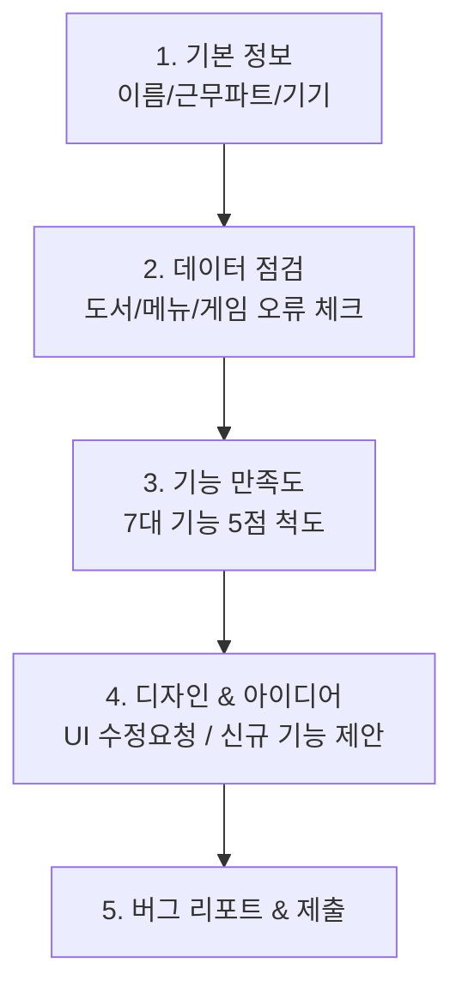

# 📱 카툰플러스 매장 직원 피드백 구글 폼 (Google Forms) 설계 & 자동 생성 가이드

> **배경**: 매장 직원이 근무 중 스마트폰이나 카운터 태블릿으로 3~5분 만에 손쉽게 응답할 수 있도록 모바일에 최적화된 구글 폼 구조와, **복사-붙여넣기로 1초 만에 폼을 자동 생성하는 Google Apps Script**를 제공합니다.

---

## 🚀 1분 만에 구글 폼 자동 생성하는 방법 (Google Apps Script)

수동으로 질문을 하나씩 만들 필요 없이 아래 코드를 실행하면 구글 드라이브에 완성된 설문지가 즉시 생성됩니다.

1. **[Google Apps Script](https://script.google.com/)** 접속 후 **`새 프로젝트`** 클릭
2. 기존 코드를 모두 지우고 **아래 스크립트 복사 & 붙여넣기**
3. 상단 **`실행 (Run)`** 버튼 클릭 (권한 승인 팝업 시 허용)
4. 실행 완료 로그에 출력되는 **`설문지 편집 URL`** 및 **`직원 전달용 응답 URL`** 확인!

```javascript
function createCartoonPlusFeedbackForm() {
  const form = FormApp.create('[카툰플러스] 매장 직원 1차 피드백 & 데이터 점검 (Day 1)');
  form.setDescription(
    '카툰플러스 서비스 도입 초기 현장 데이터 정합성 점검 및 기능/디자인 개선 의견을 수집하는 설문입니다.\n' +
    '⏱️ 소요 시간: 약 3~5분 | 모바일에서 간편하게 작성하실 수 있습니다.'
  );
  form.setAllowResponseEdits(true);
  form.setCollectEmail(false); // 이메일 수집 없이 익명/간편 작성

  // 1. 기본 정보 섹션
  form.addSectionHeaderItem().setTitle('🧑‍💼 1. 기본 정보');
  form.addTextItem().setTitle('이름 또는 닉네임 (직책)').setHelpText('예: 홍길동 (주말 오전)').setRequired(true);
  
  form.addMultipleChoiceItem()
    .setTitle('근무 파트 (시간대)')
    .setChoiceValues(['오픈 (오전)', '미들 (오후)', '마감 (야간)'])
    .setRequired(true);

  form.addCheckboxItem()
    .setTitle('주로 사용하는 기기 (중복 선택 가능)')
    .setChoiceValues(['카운터 포스/PC', '개인 스마트폰', '매장 태블릿'])
    .setRequired(true);

  // 2. 데이터 정합성 점검 (오류 체크)
  form.addPageBreakItem().setTitle('🔍 2. 매장 데이터 점검 (잘못된 정보 체크)').setHelpText('실제 매장과 화면에 등록된 정보가 다른 부분을 체크해 주세요.');
  
  form.addCheckboxItem()
    .setTitle('잘못된 정보가 발견된 영역을 선택해 주세요.')
    .setChoiceValues([
      '도서 권수 불일치 (실제 보유 권수와 화면 표시가 다름)',
      '서가 위치 오류 (화면의 위치 코드와 실제 책 위치가 다름)',
      '도서 검색 누락 (매장에 있는데 검색이 안 됨)',
      '식음료 메뉴판 오류 (가격 다름 / 품절 메뉴 노출 등)',
      '즐길거리(게임) 오류 (없는 게임 노출 / 인원수 표기 오류)',
      '매장 이벤트 및 이용안내 오류 (종료된 행사 / 영업시간 등 오기재)',
      '이상 없음 (데이터가 모두 정확함)'
    ]);

  form.addParagraphTextItem()
    .setTitle('발견된 잘못된 정보의 상세 내용을 적어주세요.')
    .setHelpText('예: 체인소맨 12권 위치가 A-03이 아니라 B-02에 있음 / 신라면 가격이 4,500원으로 잘못 나옴');

  // 3. 기능 만족도 평가
  form.addPageBreakItem().setTitle('⚡ 3. 주요 기능 사용 만족도').setHelpText('기존 방식(파파고/Caspio/수기) 대비 얼마나 편리해졌는지 평가해 주세요. (1점: 매우 불편 ~ 5점: 매우 편리)');

  const features = [
    '직원 간편 로그인 / 계정 접속',
    '도서 검색 및 서가 위치 확인 (손님 응대)',
    '도서 재고 단권 수정 및 서가 변경',
    '도서 입고 신청 확인 및 처리',
    'Web Speech 원클릭 매장 안내 방송 (TTS)',
    '예약 방송 스케줄러 (시간 지정 자동 방송)',
    '모바일 / 포스기 화면 터치 및 사용 편의성'
  ];

  features.forEach(function(feature) {
    form.addScaleItem()
      .setTitle(feature)
      .setBounds(1, 5)
      .setLabels('매우 불편', '매우 편리');
  });

  // 4. 디자인 및 신규 기능 아이디어
  form.addPageBreakItem().setTitle('🎨 4. 디자인 개선 & 신규 기능 제안');

  form.addParagraphTextItem()
    .setTitle('🎨 디자인 / 화면(UI) 변경 요청')
    .setHelpText('글자 크기, 버튼 위치, 색상, 터치 편의성 등 화면에서 바뀌었으면 하는 점을 자유롭게 적어주세요.');

  form.addParagraphTextItem()
    .setTitle('💡 "이런 기능이나 화면이 추가되면 좋겠다!" (신규 아이디어)')
    .setHelpText('손님 응대나 매장 관리 시 업무를 더 편하게 만들어줄 새로운 아이디어를 제안해 주세요.');

  // 5. 오류 및 버그 리포트
  form.addPageBreakItem().setTitle('⚠️ 5. 오류 / 버그 리포트');

  form.addParagraphTextItem()
    .setTitle('작동하지 않거나 에러 메시지가 뜬 현상이 있다면 적어주세요.')
    .setHelpText('발생 시각, 화면, 어떤 동작을 했을 때 이상이 생겼는지 알려주시면 신속히 수정하겠습니다.');

  Logger.log('✅ 설문지 생성 완료!');
  Logger.log('🔗 설문 편집 URL: ' + form.getEditUrl());
  Logger.log('📢 직원 배포용 URL: ' + form.getPublishedUrl());
}
```

---

## 📱 모바일 설문지 구조 및 질문 목록 (수동 작성 시 참조)

수동으로 구글 폼을 만들 때 아래와 같이 5개 페이지(섹션)로 나누면 모바일에서 스크롤 부담 없이 깔끔하게 표시됩니다.



### 📋 섹션별 세부 문항 요약

| 섹션 | 문항명 | 유형 | 필수 여부 |
| :--- | :--- | :---: | :---: |
| **1. 기본 정보** | 1. 이름 또는 닉네임 (직책) | 단답형 | 필수 |
| | 2. 근무 파트 (오픈/미들/마감) | 객관식 (1개 선택) | 필수 |
| | 3. 주로 사용하는 기기 (포스/폰/태블릿) | 체크박스 (중복 선택) | 필수 |
| **2. 데이터 점검** | 4. 잘못된 정보 발견 영역 체크 | 체크박스 | 선택 |
| | 5. 데이터 오류 상세 내용 (도서/메뉴/위치 등) | 장문형 | 선택 |
| **3. 기능 만족도** | 6~12. 7대 주요 기능별 편의성 (1~5점) | 선형 배율 (1~5점) | 선택 |
| **4. 디자인 & 제안** | 13. 디자인/UI 변경 희망 사항 | 장문형 | 선택 |
| | 14. 신규 기능 및 화면 아이디어 제안 | 장문형 | 선택 |
| **5. 버그 리포트** | 15. 에러/오작동 리포트 | 장문형 | 선택 |

---

## 💡 모바일 배포 팁 (매장 현장 운영)

1. **카운터 QR코드 비치**: 구글 폼 링크를 무료 QR코드 생성기(예: Chrome 주소창 QR 생성 기능)로 만들어 카운터 모니터 옆이나 직원 락커룸에 부착
2. **단축 링크 (bit.ly 등) 활용**: 매장 단톡방이나 카카오톡 공지사항에 고정
3. **Google Sheets 연동**: 구글 폼 `응답` 탭에서 `스프레드시트에 연결`을 활성화하면 실시간으로 PM/점주 대시보드 구축 가능
